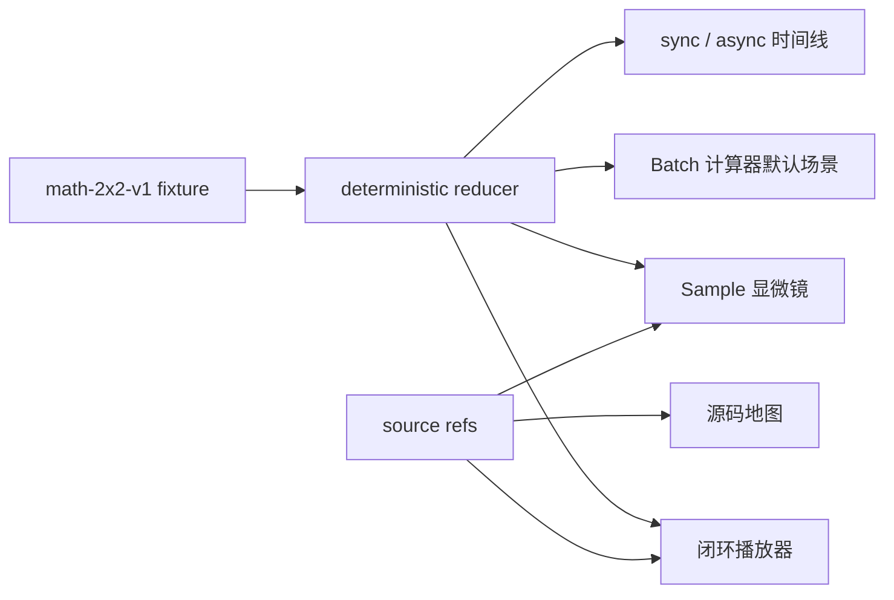

# slime Lab — M1 Implementation Brief

> 这份文档是 M1 第一个纵向切片的施工合同。
>
> 总体方向由路线文档维护，课程事实由 storyboard 维护；本文只锁定本轮的产品边界、技术边界、目录、组件、数据契约、实施顺序和验收门槛。

| 项目项 | 当前值 |
| --- | --- |
| 文档状态 | `M1 public release approved / Cloudflare handoff in progress` |
| 里程碑 | M1：第一个纵向切片 |
| 产品工作名 | `slime Lab` |
| 建立日期 | 2026-08-08 |
| 目标发布物 | 已完成中文私有预览；正在发布免费公网 Workers 版本 |
| 当前预览 | [slime Lab M1](https://slime-lab-sample-journey.qnybkyhzm52911.chatgpt.site)（owner-only） |
| 公网源码 | [yehu77/slime](https://github.com/yehu77/slime)（个人 fork） |
| 项目位置 | 当前 slime 仓库的 `website/` |
| slime 内容基线 | `v0.3.1-1-g06ffdbe2` / `06ffdbe22be068b52f9ed0fc318c473f7030197e` |
| 产品与课程路线 | [slime 教学网站总体路线](./SLIME_LEARNING_SITE_ROADMAP.md) |
| 首课事实源 | [《一条 Sample 的旅程》Storyboard](./SLIME_SAMPLE_JOURNEY_STORYBOARD.md) |

## 0. M1 的一句话结果

交付一个无需 GPU、无需账号、可以在 30 分钟内完整学习的中文网站切片：用户从首页进入《一条 Sample 的旅程》，通过同一份固定 fixture 操作闭环播放器、Sample 显微镜、Batch 计算器和同步 / 异步时间线，完成知识检查，并能继续从固定版本的源码和测试学习。

M1 不是“搭好导航和空页面”，而是第一个可从入口走到学习成果的完整产品体验。

## 1. 已确认决策

| 决策项 | M1 结论 | 对实施的直接影响 |
| --- | --- | --- |
| 工作名 | `slime Lab` | 页面 metadata、导航、OG card 和文案统一使用该名称 |
| 第一优先用户 | 具备 Python / PyTorch 和基础 RL 概念、第一次采用或深入 slime 的研究者与工程师 | 不从零讲深度学习；所有系统术语首次出现有短解释 |
| 仓库边界 | 原型位于当前仓库 `website/`，不修改 slime 核心训练路径 | 网站拥有独立 package，但由父仓库统一版本控制，不能保留嵌套 `.git` |
| 视觉气质 | 严谨的系统教材为主，克制的 slime 趣味为辅 | 强信息层级、技术图和数据卡；亮绿色只作有限强调，不做玩具化页面 |
| 语言 | M1 只提供中文；目录和内容 schema 预留英文 | 默认 URL 不加 `/zh`；未来英文使用 `/en/...`，M1 不发布空英文页面 |

同时确认：

- M1 使用浏览器本地状态，不接账号、D1、R2 或其他数据库；
- M1 不执行真实 SGLang / Megatron 训练；
- 对外技术链接固定到上述 slime commit；
- `website/` 是否长期留在上游仓库，可在 M1 私有预览验证后、正式公开或向上游提交前复议，不阻塞当前施工。

## 2. 成功标准与边界

### 2.1 用户结果

目标用户完成 M1 后能够：

1. 复述 `Dataset → DataSource → SGLang → Reward → Train Data → Megatron → Weight Sync` 闭环；
2. 区分 `group_index`、`index`、`Sample.rollout_id` 和训练循环 `rollout_id`；
3. 检查 response 侧 mask / log-prob 长度不变量；
4. 算出 fixture 中 `4 logical rollouts → 2 training steps`；
5. 说明同步与异步主循环的 overlap、旧权重和 barrier；
6. 在固定版本源码和 CPU contract tests 中找到对应证据。

### 2.2 产品结果

- 五个范围内页面全部可访问，没有伪装成已完成的空栏目；
- 《一条 Sample 的旅程》normal path 完整可操作；
- 一份 fixture 驱动四个核心交互；
- 桌面、平板和移动端都能完成主要学习路径；
- 键盘和 reduced-motion 模式不丢失信息；
- 构建、内容校验和关键状态逻辑测试通过；
- 交付一个私有 Sites 预览，公开发布由项目发起人另行决定。

### 2.3 M1 不做

- 用户账号、登录、云端进度、评论、证书和排行榜；
- D1、R2、上传或任何持久化后端；
- 真实在线 rollout、GPU 训练、性能估算；
- 全量课程、全量术语、全仓库源码浏览；
- 完整 partial / fully async / fan-out agent 分支；
- 英文页面、暗色主题切换、站内全文搜索；
- 对上游 slime 仓库提交或正式公共域名。

## 3. M1 页面清单

| 路由 | 页面任务 | 第一屏必须回答 | 完成出口 |
| --- | --- | --- | --- |
| `/` | 产品入口与五种意图分流 | “slime Lab 能帮我从会跑脚本走到理解系统吗？” | 主 CTA 进入 `/start`，首课 CTA 直达 lesson |
| `/start` | 先修自测、90 秒心智模型、路线选择 | “我需要懂什么，从哪条路径开始？” | 进入《一条 Sample 的旅程》 |
| `/learn/sample-journey` | M1 核心课程与四个交互 | “一条 Sample 怎样走完整个 RL 闭环？” | 通过知识检查，进入源码或下一课预告 |
| `/glossary` | 本课 15–20 个术语及反向链接 | “这个词在 slime 中具体指什么？” | 回到原课程上下文 |
| `/source` | 本课 concept ↔ symbol ↔ test 最小源码地图 | “课程结论在当前 commit 的哪里？” | 打开固定 GitHub source / test 链接 |

M1 不创建博客、recipes、labs、correctness 等空路由。首页可以展示后续方向，但必须明确标记“规划中”。

### 3.1 首页冻结文案

第一版主标题：

> 把 slime 从训练脚本，变成你能解释的系统。

支持文案：

> 用交互式闭环、Sample 字段追踪、源码锚点和可验证实验，理解 rollout、训练与权重同步为什么这样连接。

主 CTA：`开始理解 slime`；次 CTA：`先看一条 Sample 的旅程`。

文案可在视觉排版时微调字数，但不能变成泛化的 AI 营销语。

## 4. 视觉与交互方向

### 4.1 视觉原则

- **像教材**：层级稳定、留白清楚、正文可连续阅读；
- **像系统工具**：数据字段、状态、版本和证据可定位；
- **有一点 slime**：用有机圆角、柔和连接线和酸绿色强调“流动”，不使用大面积黏液插画；
- **不伪装真实运行**：教学数据、系统事实和未来功能使用不同标签；
- **不靠动画解释**：所有动画都有文字稿和静态等价视图。

### 4.2 初始 design tokens

这些值是施工默认，可在首次完整预览后做一次整体校准：

| token | 初始值 | 用途 |
| --- | --- | --- |
| `paper` | `#F6F7F1` | 页面背景 |
| `surface` | `#FFFFFF` | 卡片与显微镜 |
| `ink` | `#17211B` | 主文字 |
| `muted` | `#5F6D64` | 次级信息 |
| `border` | `#CAD2C8` | 分隔与未激活路径 |
| `moss` | `#315C46` | 主操作、链接、已验证状态 |
| `slime` | `#B7F34A` | 小面积高亮；只搭配深色文字 |
| `aqua` | `#7DD3C7` | 派生数据与系统层辅助区分 |
| `warning` | `#9A5B00` | trimming、needs-review |
| `danger` | `#B42318` | invariant / schema 错误 |

正式实现需逐项验证对比度，不能因为表中有颜色就跳过 WCAG 检查。

### 4.3 字体、图形与动效

- 中文优先使用系统字体栈：`PingFang SC / Noto Sans CJK SC / system-ui`；
- 英文与数字沿用同一 sans 栈，代码使用 `SFMono-Regular / ui-monospace`；
- 不依赖构建时下载的在线字体；
- 使用 CSS、文字、边框和现有图标组件表达系统关系，避免手写 SVG 插画；
- 默认不自动播放；尊重 `prefers-reduced-motion`；
- 状态不能只用绿色 / 红色区分，必须有文字、图标或线型。

视觉与主要文案稳定后，按 Sites 流程只发起一次专用 OG social card 生成；仅当结果不可用时重试一次。人工检查图中文字、品牌和实际页面是否一致，通过后保存为 `public/og.png`，并用请求 host 派生绝对 metadata URL；若仍不合格就省略 `og:image`，不发布通用 fallback。OG 接入完成后才执行最终 production build。

## 5. 技术形态

### 5.1 初始化与运行平台

M1 采用 Sites 的 vinext starter，并保留其 Cloudflare Worker-compatible ESM 构建方式：

- React + TypeScript；
- vinext + Vite；
- Zod 用于内容和 fixture 的运行时 schema 校验；
- Vitest 用于不依赖浏览器的 reducer、schema、Batch 与 source-link 单元测试；
- npm 与 starter lockfile；
- Node.js `>= 22.13.0`；
- `.openai/hosting.json` 中 `d1: null`、`r2: null`；
- 不导入 authentication helper，不读取用户身份 header；
- 完成后使用 Sites 生成私有预览。

初始化时必须满足：

1. `website/` 是新的项目表面，但由父 slime 仓库版本控制；
2. Sites initializer 只能运行一次；
3. 在空 `website/` 中预建空 `.git` sentinel，阻止 initializer 创建嵌套仓库；从该目录调用 Sites 插件根的 `scripts/init-site.sh "$PWD"`，并以 finally / trap 语义在成功或失败后只用 `rmdir` 移除仍为空的 sentinel；
4. 根 `.gitignore` 的 `build/` 会忽略 starter 必需的 `website/build/sites-vite-plugin.ts`，初始化时加入精确的 `!website/build/` 与 `!website/build/**` 例外并用 `git check-ignore` 验证；
5. 网站 runtime、Cloudflare build 和托管代码不得 import `../slime`、Python 模块或父仓库脚本；
6. 保留 starter 的 `sites()` Vite plugin 与 hosting 配置；
7. 初始化完成后立即启动 dev preview，直到 build 与私有部署结束；
8. 正式页面必须替换 starter skeleton、metadata、图标和预览标记；删除 `app/_sites-preview` 及 imports，替换 starter rendered test；
9. 若成品不再使用 `react-loading-skeleton`，移除依赖并刷新 lockfile；同时移除 M1 不使用的 auth、D1 / Drizzle scaffold 与依赖，不让 starter 默认能力扩大产品范围。

### 5.2 渲染与状态边界

- 首页、Start、Glossary、Source 和课程静态正文优先作为 server / static content；
- 只有播放器、显微镜、计算器、时间线、答题和本地进度是 client islands；
- 交互状态使用一个纯 `useReducer` 模型，不引入全局状态库；
- fixture 在构建期通过 Zod 与 domain invariants 校验，浏览器只加载已验证的静态数据；
- 学习进度使用版本化 localStorage key：`slime-lab:progress:v1`；
- localStorage 只保存 lesson completion、最后事件和答题结果，不保存用户身份或输入内容；
- 进度状态为 `not_started → in_progress → completed`，assessment / fixture 核心版本升级时旧完成记录进入 `review_required`；
- lesson 文案小改不清空完成状态；assessment version、fixture 或核心目标升级时提示复习，不静默删除；
- localStorage 不可用时课程仍可完整操作，进度只保留当前 session 并显示提示；
- schema 不兼容时安全忽略旧本地状态，并保留恢复提示。

课程完成规则：

- 先修自测不计分、不阻断；90 秒速览不能单独完成课程；
- 必须访问七幕并提交章末检查；
- 总分至少 `7 / 9`，且 `q4 / q5 / q8` 必须正确；
- 允许无限重试，保存最高成绩和最近一次答案，不记录失败惩罚；
- 打开 GitHub 或运行 CPU test 是推荐行为，不作为完成条件；
- 完成状态不锁住其他页面，只改变推荐路径和“继续学习”入口。

### 5.3 内容载体

- M1 的课程叙事、术语、题目和 event copy 使用 Zod 校验的 TypeScript content modules；
- 交互 fixture、事件、source refs 与验收期望使用 typed JSON / TypeScript schema；
- fixture 核心只保存稳定 ID、数值、patch 与 `copy_key`；中文 prompt、narration 和 transcript 放在 locale overlay，未来英文不复制业务事件；
- M1 不引入通用 MDX 编译链，避免 vinext beta、RSC 与 MDX plugin 的额外兼容风险；
- M2 在普通文章型课程增多前单独验证 Markdown / MDX 管线，沿用同一 metadata、evidence 与 locale schema；
- 长文案必须位于 content module，不得散落进交互组件。

## 6. 建议目录

```text
website/
  .openai/
    hosting.json
  app/
    layout.tsx
    globals.css
    page.tsx
    start/page.tsx
    learn/sample-journey/page.tsx
    glossary/page.tsx
    source/page.tsx
    error.tsx
    not-found.tsx
  components/
    site/                  # header、footer、intent cards、version badge
    lesson/                # lesson shell、progress、source cards、checks
    journey/               # player、stage、microscope、calculator、timeline
    ui/                    # button、tabs、badge、callout、dialog
  content/
    schema.ts
    zh/
      lessons/sample-journey.ts
      glossary.ts
      messages/sample-journey.ts
  data/
    fixtures/sample-journey/math-2x2-v1.json
    source-refs/slime-06ffdbe2.refs.json
    source-refs/slime-06ffdbe2.anchors.generated.json
    evidence/slime-06ffdbe2.cpu.generated.json
  core/
    content-loader.ts      # content/schema.ts 是 schema 的唯一 owner
    journey/
      schema.ts
      reducer.ts
      invariants.ts
      batch-calculator.ts
      source-links.ts
    progress/local-progress.ts
  scripts/
    generate-source-anchors.py
    validate-content.mjs
    scan-unsafe-commands.mjs
  tests/
    fixture.test.ts
    reducer.test.ts
    batch-calculator.test.ts
    source-links.test.ts
    rendered-routes.test.ts
  public/
    og.png                  # 只有专用社交卡校验通过时才存在
```

不创建空 `content/en/`；locale registry 和语言无关内容 ID 已足够预留未来 `/en/...`。目录以 starter 实际构建约定为准，可以合并小文件，但不能破坏三个边界：

```text
课程正文 ≠ 交互 fixture ≠ 组件状态
raw Sample ≠ derived train data ≠ system state
中文已发布内容 ≠ 英文预留结构
```

## 7. 内容与数据契约

### 7.1 Lesson metadata

每课至少提供：

```yaml
schema_version: 1
id: core.sample-journey
kind: lesson
locale: zh-CN
route: /learn/sample-journey
title: 一条 Sample 的旅程
summary: 跟踪一条数据如何成为可信的训练更新。
audiences: [researcher, engineer]
level: slime-intro
duration:
  min_minutes: 25
  max_minutes: 30
  includes_assessment: true
workflow_status: technically-reviewed
freshness_status: current     # 由 evidence check 生成
visibility: public
lesson_revision: 1
prerequisites:
  - concept.rl-loop-basics
learning_objectives:
  - sample-lifecycle
  - token-alignment
  - identity-boundaries
  - weight-publication-boundary
completion:
  assessment_id: core.sample-journey.check
  assessment_version: 1
  min_correct: 7
  required_question_ids: [q4, q5, q8]
  required_acts: [1, 2, 3, 4, 5, 6, 7]
baseline:
  repository: THUDM/slime
  nearest_tag: v0.3.1
  describe: v0.3.1-1-g06ffdbe2
  commit: 06ffdbe22be068b52f9ed0fc318c473f7030197e
fixture_ids: [math-2x2-v1]
glossary_term_ids:
  - sample-object
  - prompt-group
  - logical-rollout
  - loss-mask
  - rollout-log-prob
source_ref_ids:
  - sample.dataclass
  - sample.append-response-tokens
  - rollout.convert-train-data
test_ref_ids:
  - sample.contract.cpu
  - dp-schedule.contract.cpu
owners:
  content: project-initiator
  technical_review: project-initiator-or-designated-slime-reviewer
```

`workflow_status` 表示创作与审核进度；`freshness_status` 表示证据是否仍然有效，两者不得合并。`source_refs` 和 tests 位于独立 evidence manifest，lesson metadata 只存稳定 ID，避免正文复制行号。

### 7.2 Fixture ownership

`math-2x2-v1.json` 是四个交互的唯一运行事实源：



storyboard 第 11 节约束 11 个 phase、事件语义、字段 snapshot、patch 和 expected values；本文第 7.2 节额外锁定语言无关 fixture + locale overlay 的存储边界。若以后两者发生歧义，先修正文档再实现，组件内不得重新硬编码 reward、token、rollout ID 或权重版本。

核心 fixture 不直接保存中文教学句子：

```text
event.narration_key  → zh messages 中的短讲解
event.transcript_key → zh messages 中的无障碍文字稿
sample.prompt_key    → zh messages 中的示例 prompt
```

loader 在校验 locale overlay 完整性后物化出运行时 `SampleSnapshot`。这样英文课程未来只增加英文 overlay，不复制 event、patch、reward 或 schedule。

### 7.3 Source refs

作者只维护 `slime-06ffdbe2.refs.json` 中的稳定身份：

```json
{
  "id": "sample.append-response-tokens",
  "commit": "06ffdbe22be068b52f9ed0fc318c473f7030197e",
  "path": "slime/utils/types.py",
  "symbol": "Sample.append_response_tokens",
  "test_ref_ids": ["sample.contract.cpu"]
}
```

`generate-source-anchors.py` 接受显式 `--repo-root`，或从自身文件位置解析并验证父 slime 仓库根；它不得依赖调用者当前目录。脚本使用 `git -C <repo-root> show <commit>:<path>` 读取固定 commit，并用 Python AST 定位 class、method、function 和 test symbol，生成确定性的 `anchors.generated.json`。生成文件保存 line range、source snippet hash 和线上 URL，不含时间戳或本机绝对路径。

线上链接按以下模板生成：

```text
https://github.com/THUDM/slime/blob/{commit}/{path}#L{start}-L{end}
```

生成与 `--check` 模式检查：

- 固定 commit 中的文件和 symbol 存在且唯一；
- generated manifest 与稳定 ref 没有漂移；
- source / test tier、claim IDs 和 lesson baseline 一致；
- GitHub URL、line range 和 snippet hash 可确定重建。

Cloudflare build 不运行 Python 或 Git；托管页面只消费已提交的 generated manifest，不在运行时依赖父仓库文件系统。symbol 是证据身份，行号只是该 commit 下的展示值。

Evidence manifest 将 source 与 test 分开记录：

```yaml
source:
  commit:
  path:
  symbol:
  claim_ids: []
  symbol_hash:
  verified_by:
test:
  path:
  symbol:
  tier: cpu-unit | cpu-distributed | gpu-e2e | site-fixture
  command_id:
  required_for_publish: true
  last_passed_commit:
```

M1 内容 gate 的测试口径：

- `tests/test_sample.py` 与 `tests/test_dp_schedule.py` 是 required CPU evidence；
- `tests/test_full_disk_weight_update.py` 只能作为 4-GPU E2E 辅助证据，不能被普通 `pytest` 记录伪装为已执行单测；
- `RolloutDataSource.get_samples` 当前主要由生产源码证明，站点 fixture test 补充教学契约；plugin rollout contract 不能被描述成直接证明 deepcopy / 编号；
- path 与 symbol 存在只证明证据可定位，不等于相关 test 已通过；test pass record 单独生成。

required CPU evidence 必须从父 slime 仓库、在受支持的 slime 测试环境中执行：

```text
python -m pytest -q tests/test_sample.py tests/test_dp_schedule.py
```

通过后生成 `data/evidence/slime-06ffdbe2.cpu.generated.json`，至少记录 baseline commit、精确 command ID、test paths、结果和通过的 commit；不把未安装依赖、未执行或 GPU E2E 的状态写成 pass。Cloudflare build 只校验这份已提交记录，不运行父仓库 Python 测试。

### 7.4 内容与新鲜度状态

```text
创作：researched → drafted → content-reviewed → technically-reviewed → ready → verified → published
新鲜度：current | needs-review | stale
```

- storyboard 当前属于 `technically-reviewed`；
- 页面与交互通过自动 gate 后进入 `ready`，不是仅凭作者判断；
- 私有预览达到目标用户验收门槛后进入 `verified`；项目发起人决定公开后才标 `published`；
- source symbol 在新提交中变化或 required test 未重跑时标 `needs-review`；
- symbol 消失、invariant / required test 失败或正文与基线矛盾时标 `stale`；
- 不能用更新 `last_verified` 日期代替 evidence 检查。

### 7.5 内容生产与审核

每一页技术内容按以下门禁前进：

1. research packet：学习目标、claims、明确不讲的内容、baseline、source / test evidence；
2. storyboard：叙事、误解、检查题、fixture 与交互学习价值；
3. fixture-first：先固化 schema、event 与 invariant，UI 只读；
4. 中文初稿：claim、glossary、source ref 使用稳定 ID；
5. 内容审核：术语、句子负担、研究者与工程师是否都能理解；
6. 技术审核：逐 claim 对照固定 commit，source proof 与 test proof 分开批准；
7. 自动验证：schema、IDs、anchors、链接、安全、build 与静态 a11y；
8. 目标用户验收：记录时间、错误模型、求助点和完成结果；
9. 发布维护：`workflow_status=ready` 且 freshness 为 `current` 时可部署私有预览；目标用户验收后进入 `verified`，只有 `verified + current` 才进入公开发布决策。

Codex 可以准备 evidence 和初审，但不能作为唯一技术批准者；技术批准由项目发起人或指定的 slime reviewer 完成。

### 7.6 中文术语

写作统一使用：

- `Sample` 写作“`Sample` 对象 / 实例”，不单独翻译成含糊的“样本”；
- 同一 prompt 的多次生成称“同组候选”；只有一次逻辑 rollout 拆出的片段称“rollout sibling / 同一逻辑 rollout 的派生片段”；
- fixture 关闭 std normalization，因此 `reward - group mean` 称“组内中心化 reward”，不称“标准化 reward”；
- 明确区分训练循环 `rollout_id` 与 `Sample.rollout_id`、Megatron actor model 与 Ray actor；
- 代码标识符保留英文并使用反引号，首次出现给出中文解释。

每个 glossary entry 至少提供：

```yaml
id:
zh_label:
code_label:
definition:
aliases: []
avoid: []
disambiguation:
source_ref_ids: []
used_by: []
```

内容校验拒绝未知 glossary ID；`/glossary` 与 `/source` 从 lesson manifest 反向生成，不维护第二份人工索引。

## 8. 组件边界

| 组件 | 类型 | 输入 | 负责 | 不负责 |
| --- | --- | --- | --- | --- |
| `SiteHeader` | static/server | route、brand | 导航、版本入口 | 学习状态业务逻辑 |
| `IntentGrid` | static/server | 五种意图 | 首页分流 | 动态个性化 |
| `PrerequisiteCheck` | client | 4 道题 | 先修反馈、本地结果 | 阻断学习 |
| `LessonShell` | static/server | metadata、typed content | 课程结构、章节、source slots | 播放器状态 |
| `JourneyExperience` | client boundary | fixture、source refs | 持有 reducer 与 selected Sample | 修改 fixture |
| `JourneyPlayer` | client | phase、dispatch | 控制、seek、文字稿 | 自己生成 snapshot |
| `SystemStage` | client | current snapshot | actor、数据移动、状态图 | 技术文案事实源 |
| `SampleMicroscope` | client | raw / derived / system slices | 字段 diff、token、invariant | 混合三层数据 |
| `BatchCalculator` | client + pure lib | 用户整数输入 | logical / physical / step / trim 计算 | GPU 性能估算 |
| `SyncAsyncTimeline` | client | fixture timeline | overlap、version、barrier | 真实耗时 benchmark |
| `KnowledgeCheck` | client | questions、progress | 评分、反馈、重试 | 账号或云同步 |
| `SourceCard` | static/server | source ref | 固定版本链接与测试证据 | 动态抓取 GitHub |
| `LocalProgress` | client utility | versioned state | 设备本地完成状态 | 身份、遥测 |

所有纯计算逻辑从 React 组件中抽出，以便 Node 单元测试直接验证。

## 9. 实施批次

### Batch A：站点基础

范围：

- Sites initializer、父仓库集成、依赖与 dev preview；
- 移除 starter skeleton、preview metadata 和未使用的临时 UI；
- `slime Lab` metadata、中文 `lang`、系统字体和视觉 tokens；
- 五个 route shell、全局导航、404 / error boundary 基础；
- 无 D1 / R2 / auth 的 hosting 配置。

退出条件：五个 route 都不是 starter 或空白页，dev preview 健康，route smoke 与 typecheck 通过；此时不提前执行最终 production build。

### Batch B：Fixture engine

范围：

- `math-2x2-v1`、schema、source refs；
- 纯 reducer、snapshot materialization、seek / reset；
- invariant、Batch 计算函数、source link builder；
- 对应 Node 单元测试。

退出条件：11 个 phase 的 state hash 确定，默认和 trimming 计算符合 storyboard。

### Batch C：首课交互

范围：

- 七幕内容与 lesson shell；
- 播放器、事件文字稿、显微镜；
- Batch 计算器、sync / async 时间线；
- 知识检查与 local progress；
- empty / error / reset / reduced-motion。

退出条件：只用浏览器、无网络数据调用即可从头到尾完成课程。

### Batch D：入口、术语与源码地图

范围：

- 首页五种意图；
- Start 自测与 90 秒入口；
- 本课术语表；
- 最小源码地图及反向链接；
- 页面 metadata、内部导航和 completion exit。

退出条件：完整用户路径从 `/` 进入课程，再进入术语或源码证据，不遇到空路由。

### Batch E：硬化与私有预览

范围：

- 内容、fixture、CPU evidence、source ref、unsafe command、route smoke 与静态 a11y tests；
- 实现 360 / 768 / 1280 布局规则、键盘行为与 reduced-motion 等价视图；
- 专用 OG card 与 metadata；
- 在全部实现与 OG 接入完成后执行一次最终 production build；失败修复后重跑，不为阶段性检查重复构建；
- 生成私有预览的多视口、键盘、触摸和焦点人工验收清单；
- 记录已知限制；
- 部署私有 Sites preview。

退出条件：自动 gate 与最终 build 通过，用户可以打开稳定私有预览，并按清单完成人工学习和界面验收。未获用户明确授权时，不把浏览器截图、DOM 操作、点击或视觉回归伪装成自动通过项。

## 10. 自动测试矩阵

| 层 | 检查 | 失败策略 |
| --- | --- | --- |
| TypeScript / build | vinext production build、strict typecheck | 阻断部署 |
| parent CPU evidence | `test_sample.py`、`test_dp_schedule.py` 与 pass record | 未执行时 `needs-review`，失败时阻断 ready |
| fixture schema | 必填字段、enum、null 语义、11 phases | 阻断构建 |
| reducer | forward、seek、reset、scene switch、state hash | 阻断构建 |
| invariants | mask / log-prob / response length、fan-out preview | 阻断构建 |
| Batch calculator | 默认 4→2 steps、6→4+2 trim、非法输入 | 阻断构建 |
| source links | URL 生成、文件、行号、symbol、test path | 阻断或 `needs-review`，不得静默通过 |
| content metadata | locale、workflow / freshness status、objectives、baseline、evidence IDs | 阻断构建 |
| safety scan | 宽泛删除、未限定 target、secret-like 文案 | 阻断内容发布，人工复核 |
| route smoke | 五个 route 有标题、主区域和导航 | 阻断部署 |
| static accessibility | label、heading、landmark、无明显 JSX a11y 错误 | 阻断部署 |
| local progress | schema version、旧数据忽略、清除确认 | 阻断部署 |

建议验证顺序：

```text
# 在父 slime 仓库、受支持的测试环境中
python -m pytest -q tests/test_sample.py tests/test_dp_schedule.py

# 在 website/ 中
npm run check:content
npm run test:unit
npm run lint:a11y
npm run typecheck
npm run build
npm run test:rendered     # 复用已生成的 build，不再次触发 build
```

starter 默认 `npm test` 会先 build；M1 应拆开该脚本，避免完整验证链重复构建。前四个 npm gate 可以在施工中反复运行；source、文案和 OG 冻结后执行一次最终 `npm run build`，只有修复真实失败时才重跑，`test:rendered` 复用该输出。浏览器截图、DOM 操作、点击、resize 和视觉回归属于单独的用户授权 QA 步骤，不在未请求时自动进行；360 / 768 / 1280、触摸和完整焦点流默认由项目发起人在私有预览按清单验收。

## 11. 验收与发布门槛

### 11.1 工程门槛

- [x] starter skeleton、starter title、preview marker 和通用 fallback 图标已移除；
- [x] `.openai/hosting.json` 保持 `d1: null / r2: null`；
- [x] `website/` 由父仓库跟踪，没有嵌套 `.git`；
- [x] production build 和自动测试通过；
- [x] 五个 route 可渲染，所有内部链接有效；
- [x] source refs 固定到 `06ffdbe2…` 并通过本地核验；
- [x] 两个 required CPU tests 已在基线 commit 通过，pass record 与结果一致；
- [x] localStorage 有版本、恢复和清除语义；
- [x] 没有真实 GPU / network runtime 依赖；
- [x] 无危险命令或未审查的复制粘贴说明；
- [x] private Sites preview 部署成功。

### 11.2 课程门槛

以 storyboard 第 14 节为准，至少满足：

- [x] 七幕、11 phase、四个 Sample 和四个交互共享同一 fixture；
- [x] raw Sample、derived train data、system state 严格分离；
- [x] 默认 Batch 显示 `4 / 4 / 2 / 0`；
- [x] finish reason 三种状态解释正确；
- [x] sync / async 展示 overlap、旧版本和 barrier；
- [x] 章末题 `7 / 9` 且关键题必对规则生效；
- [x] source / test evidence 可以从课程直达；
- [x] 所有教学值标明不是真实 tokenizer 或 benchmark。

### 11.3 发布策略

构建与托管顺序：

1. 冻结站点源码与 OG，完成 required CPU evidence、站点自动 gate 和最终 build；
2. 新站只调用一次 Sites `create_site`，将 `project_id` 写入 `website/.openai/hosting.json` 并复用返回的 source write credential；若此后改动任何 build-relevant source，重新 build；
3. 不在 `website/` 创建嵌套 Git；在系统临时目录建立 deployment export repo，复制刚刚验证的站点源码并提交，用 branch-head SHA 标识这次 source；
4. credential 只作为单条 push 的 HTTP authorization header 使用，不写入 remote URL、Git config、文档或日志；
5. 使用 Sites hosting 插件根的 `scripts/package-site.sh` 打包 `website/`，保存一个与上述 commit SHA 对应的 version；
6. 优先执行 private deployment 并轮询到成功或失败；若当前能力只能 shared / public，必须先取得项目发起人对实际访问级别的明确批准，不能自行扩大可见范围；
7. 成功后打开 connector 返回的 deployed URL，并保留该 URL 作为 M1 预览入口。

预览与学习验收顺序：

1. 项目发起人先按“首页 → 首课 → source”路径和多视口 / 键盘清单完整走查；
2. 私有预览再邀请至少 3 名、推荐 4 名目标用户，其中研究者与工程师各至少 1 名；
3. 记录完成时间、错误模型、求助点、交互阻塞和章末结果；
4. 修复 M1 blocker；
5. 再共同决定是否公开、是否迁出当前仓库和是否开始 M2。

目标用户验收门槛：

- 完成时间中位数不超过 30 分钟；
- 每位参与者都能无引导完成导航和主要交互；
- 至少全部 3 人或 4 人中的 3 人达到课程完成规则；
- 课后不再保留“reward 决定 token 是否训练”或“`loss_mask` 与完整 `tokens` 等长”等核心错误模型；
- 没有 P0 事实错误或 P1 阻断性可用性问题；
- 错题反馈能准确返回对应幕。

私有预览可以在目标用户测试前交付，但 M1 只有在上述门槛通过后才能标记为 `verified`。

### 11.4 公网生产补充决策（2026-08-08）

项目发起人已明确批准公开发布。公网生产与原 Sites 私有验收预览分离：

- GitHub 事实源为个人 fork `yehu77/slime`，网站继续位于 `website/`；
- Cloudflare Workers Builds 的 root directory 为 `website`；
- `main` 使用 `npm run build` 后执行 `npx wrangler deploy`；
- 非生产分支执行 `npx wrangler versions upload`，不改变线上 Active Deployment；
- 首发使用免费 `workers.dev` 地址，不启用账号、D1、R2、Images 或其他付费能力；
- 独立域名、Cloudflare Access 与长期仓库拆分以后再决定；
- 公网 URL 真正成功部署前，课程状态仍保持 `ready`，不提前标记为 `published`。

## 12. 风险与预案

| 风险 | 早期信号 | 预案 |
| --- | --- | --- |
| Sites 子目录形成嵌套 git | `website/.git` 存在 | 初始化整合时移除生成的嵌套边界，确认父仓库能看到全部文件 |
| typed content 逐渐失控 | 文案复制到组件或 locale overlay 缺 key | Zod 校验 content IDs，M2 再独立验证 MDX，不把 loader 风险带进 M1 |
| 四个交互状态漂移 | 同一 event 显示不同 reward / ID | 只允许 reducer 输出 snapshot，组件不复制 fixture 值 |
| 内容范围膨胀 | 新增 M2/M3 机制分支 | 只显示链接或预告，进入 roadmap backlog |
| 源码行号漂移 | source validation 失败 | 标 `needs-review`，按 symbol 重新核验，不自动猜新行号 |
| 页面很漂亮但学不会 | 用户无法回答关键题 | 以知识检查和复述结果优先调整，而不是加更多动画 |
| 移动端显微镜压住内容 | 360px 出现横向滚动或焦点丢失 | 单栏、非模态 bottom sheet、文字事件列表作为主路径 |
| 教学 fixture 被当 benchmark | 时长或 token 值脱离提示展示 | 数据层携带 notice，所有消费组件强制显示标签 |

## 13. 分工与状态更新

| 工作 | Codex | 项目发起人 |
| --- | --- | --- |
| starter 初始化与实现 | 负责 | 查看阶段性结果 |
| fixture、reducer、自动测试 | 负责 | 审核教学语义 |
| 技术内容与 source refs | 初审并实现 | 根据真实使用经验复核 |
| 视觉与响应式 | 实现并说明取舍 | 判断品牌气质 |
| 私有预览 | 构建并部署 | 完整走查 |
| 公开发布 / 仓库迁移 | 提供建议与执行方案 | 最终决定 |

施工期间，每完成一个 batch 更新本文的 gate，不为可逆的小实现细节反复阻塞；任何影响用户、仓库边界或公开发布的决定继续共同确认。

## 14. 初始化就绪检查

- [x] 工作名已确认：`slime Lab`；
- [x] 第一优先用户已确认；
- [x] `website/` 项目边界已确认；
- [x] 中文优先与 i18n 预留已确认；
- [x] 视觉方向已确认；
- [x] 五页面清单与课程验收已由 storyboard 和本文锁定；
- [x] slime baseline 与 source link 策略已锁定；
- [x] 无账号 / DB / GPU 的 M1 边界已锁定；
- [x] 运行 Sites initializer 并完成父仓库整合；
- [x] 完成 Batch A–E 的实现与自动 gate，保持 dev preview 到私有部署结束。

下一次施工从最后两项开始，不再重新讨论本 brief 已确认的默认值。
