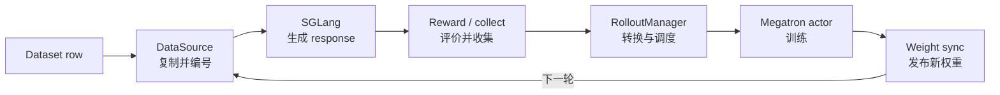
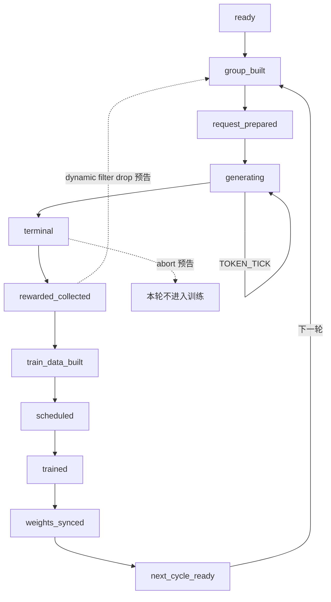

# 《一条 Sample 的旅程》课程 Storyboard

> 本文是 slime 教学网站第一课的内容与交互实施规格。
>
> 它回答“教什么、按什么顺序教、页面每一步展示什么、数据怎样变化、源码证据在哪里，以及怎样验收”。视觉稿、组件代码和完整课程文案在 M1 实施时落地，但不得偏离本文中的技术事实和教学边界。

| 项目项 | 当前值 |
| --- | --- |
| 文档状态 | `v0.3 / Implemented, public release approved` |
| 课程 ID | `core.sample-journey` |
| 页面路由 | `/learn/sample-journey` |
| 目标读者 | 会 Python / PyTorch、了解基础 RL、第一次深入 slime 的研究者或工程师 |
| 预计时长 | 25–30 分钟，包含 90 秒闭环速览与章末检查 |
| 运行要求 | 浏览器即可；无需 GPU、后端服务或模型下载 |
| slime 基线 | `v0.3.1-1-g06ffdbe2` / commit `06ffdbe22be068b52f9ed0fc318c473f7030197e` |
| 示例性质 | 固定的教学 fixture；字段形状和变化遵循源码，但 token ID 与时长不是实测 trace |
| 关联路线 | [slime 教学网站总体路线](./SLIME_LEARNING_SITE_ROADMAP.md) |
| 实施合同 | [slime Lab M1 Implementation Brief](./SLIME_LAB_M1_IMPLEMENTATION_BRIEF.md) |
| 最近更新 | 2026-08-08 |

## 0. 本文怎样约束 M1

本课是网站的第一个纵向切片，也是后续课程共享心智模型的起点。M1 的闭环播放器、Sample 显微镜、Batch 计算器和同步 / 异步时间线必须由同一份确定性 fixture 驱动，不能做成四个彼此矛盾的演示。

页面里的信息分成三类，并使用一致的视觉标签：

| 标签 | 含义 | 示例 |
| --- | --- | --- |
| 源码事实 | 当前基线中可以由源码或测试直接证明 | `loss_mask` 存在时长度等于 `response_length` |
| 教学 fixture | 为了稳定讲解而固定的值，形状与语义真实，但不是一次真实运行的录屏 | token ID `25`、`session-a0`、每段教学时长 |
| 进阶预告 | 真实存在，但本课不展开实现与全部边界 | partial rollout、compact fan-out、权重 transport |

如果三者发生冲突，以固定 commit 的源码和测试为准，并将课程标记为 `stale`，不能静默修改解释。

本课的中心命题是：

> `Sample` 不只是“模型回答的容器”，而是 rollout 与 training 之间的一份跨系统协议；身份、token 对齐、训练掩码、奖励、状态和权重版本共同决定 trainer 应怎样解释它。

## 1. 课程契约

### 1.1 驱动问题

> 一行 dataset 数据，必须经历哪些变化，才能成为一次可信的 optimizer update；更新后的权重又怎样影响下一条 Sample？

### 1.2 学习目标

完成课程后，学习者应能够：

1. 不看提示，按顺序复述 `Dataset → DataSource → SGLang → reward / collect → train data → Megatron → weight sync` 闭环；
2. 区分 dataset row、prompt group、物理 `Sample`、逻辑 rollout、rollout batch 和 training step；
3. 解释 `group_index`、`index`、`Sample.rollout_id` 与训练循环 `rollout_id` 的不同职责；
4. 根据阶段快照解释 `tokens`、`response_length`、`loss_mask`、`rollout_log_probs`、`reward` 和 `status` 的变化；
5. 检查至少三个关键不变量，并能定位一个错误应在生成侧、转换侧还是训练侧修复；
6. 指出 optimizer step 和权重同步的边界，并解释为什么历史 Sample 不会被新权重“改写”；
7. 用一张时间线说明默认同步循环与 `train_async.py` 的最小差异。

### 1.3 默认先修

学习者应已经知道：

- Python dataclass、list、dict 和异步任务的基本概念；
- token、log probability、batch、optimizer step；
- policy、rollout、reward 和 advantage 的直觉含义。

页面开头提供 4 道自测。答错不会阻止进入课程，但会给出对应的先修术语链接。

### 1.4 本课必须带走的不变量

```text
tokens = prompt token 前缀 + response token 后缀
len(loss_mask) == response_length                  # loss_mask 存在时
len(rollout_log_probs) == response_length          # rollout_log_probs 存在时
```

再增加一个身份不变量作为进阶记忆点：

```text
一次逻辑 rollout 被拆成多个训练片段时，所有 sibling 共享 Sample.rollout_id；
每个物理 Sample 仍拥有不同 index。
```

### 1.5 明确不在本课展开

- PPO / GRPO / GSPO / CISPO 的公式推导；
- Ray placement group、GPU topology、TP / PP / CP / EP；
- custom generate、group reward 和 hook 的完整选择方法；
- partial、fully async、agent fan-out 的实现细节；
- NCCL、CUDA IPC、disk full / delta 等权重 transport；
- top-p replay、routed experts、teacher log-prob、多模态和 speculative decoding。

这些内容可以作为可展开的“一句话预告”出现，但不得抢占主叙事。

## 2. 课程开场与整体节奏

### 2.1 开场钩子：同样答对，为什么一个样本完全不学习？

页面先展示两张几乎相同的卡片：

```python
A = Sample(response="5", response_length=1, reward=1.0, loss_mask=[1])
B = Sample(response="5", response_length=1, reward=1.0, loss_mask=[0])
```

首问：两条 response 都正确、reward 都是 `1.0`，哪一条会产生有效的策略梯度？

此时只记录预测，不公布完整解释。第五幕结束后回收：`reward` 评价结果，`loss_mask` 决定 response 中哪些 token 能参与优化；B 没有有效训练 token。

### 2.2 先看闭环，再进入七幕

90 秒速览只回答“谁把 Sample 交给谁”，不展开字段：



速览结束后，播放器回到第一幕，右侧 Sample 显微镜始终保留。每幕只高亮本步真正变化的字段。

### 2.3 七幕与时间预算

| 幕 | 核心问题 | 建议时长 |
| --- | --- | ---: |
| 1. 出生 | 数据行如何成为一个未完成的 `Sample`？ | 2 分钟 |
| 2. 分组 | 为什么一个 prompt 要复制成多个同组候选？ | 2.5 分钟 |
| 3. 生成 | prompt / response token、mask、log-prob 如何对齐？ | 4 分钟 |
| 4. 评价与收集 | reward、status、filter 分别决定什么？ | 2.5 分钟 |
| 5. 交接与排程 | `Sample` 如何变成 trainer batch，batch 怎样守恒？ | 4 分钟 |
| 6. 训练 | Megatron 消费什么，`Sample` 在哪里结束？ | 2.5 分钟 |
| 7. 权重回流 | 新权重怎样回到 rollout，异步改变了什么？ | 2.5 分钟 |
| 章末检查 | 复原闭环、诊断字段错误 | 4–6 分钟 |

## 3. 全课共享的受控 fixture

### 3.1 为什么固定 fixture

M1 不连接真实 SGLang 或 Megatron。四个交互组件从相同事件日志重建状态，确保：

- 播放、后退、seek、截图和测试完全确定；
- 同一阶段的 `Sample` JSON、token 视图、Batch 数量和时间线一致；
- 教学值不会被误解成硬件 benchmark 或指定 tokenizer 的真实输出；
- 源码升级后可以通过 schema、symbol 和 invariant 检查发现漂移。

### 3.2 配置

```yaml
fixture_id: math-2x2-v1
rollout_batch_size: 2       # 本轮需要收集 2 个有效 prompt group
n_samples_per_prompt: 2     # 每个 prompt 生成 2 个候选
global_batch_size: 2        # 每个 training step 包含 2 个逻辑 rollout
num_steps_per_rollout: 2    # 2 × 2 ÷ 2 = 2 个 training step
dp_size: 1                  # 首课只验证 step 切分，不引入跨 rank 拓扑
micro_batch_size: 2         # 每个 step 在本 fixture 中形成 1 个 static microbatch
use_dynamic_batch_size: false
advantage_estimator: grpo
rewards_normalization: true
grpo_std_normalization: false
prompt_key: text
label_key: label
metadata_key: metadata
apply_chat_template: false
partial_rollout: false
group_rm: false
```

这里的 `rollout_batch_size` 计有效 prompt group；默认一条生成执行产生一个训练 Sample，因此本例有 `2 × 2 = 4` 个逻辑 rollout。`global_batch_size` 在 scheduler 中计逻辑 rollout，不是 prompt group。

### 3.3 两行输入数据

为贴近 `Dataset` 默认 `prompt_key="text"`，fixture 使用：

```json
{"text":"3 + 2 = ? 只输出整数。","label":"5","metadata":{"source_name":"storyboard_math","difficulty":"warmup"}}
{"text":"4 + 3 = ? 只输出整数。","label":"7","metadata":{"source_name":"storyboard_math","difficulty":"warmup"}}
```

### 3.4 两组、四条 Sample

| fixture ID | `group_index` | `index` | response | raw reward | 组内中心化 reward | terminal status |
| --- | ---: | ---: | --- | ---: | ---: | --- |
| `a0` | 0 | 0 | `5` | 1.0 | +0.5 | `COMPLETED` |
| `a1` | 0 | 1 | `6` | 0.0 | −0.5 | `COMPLETED` |
| `b0` | 1 | 2 | `7` | 1.0 | +0.5 | `COMPLETED` |
| `b1` | 1 | 3 | `8` | 0.0 | −0.5 | `COMPLETED` |

组内中心化值是转换后的派生训练数据，不写回 `Sample.reward`。本例关闭 std normalization，只演示 `reward - group mean`，不在本课讲 advantage 公式。

### 3.5 教学 token 与稳定 ID

默认选中 `a0`：

```json
{
  "prompt_token_ids": [11, 12, 13, 14, 15],
  "response_token_ids": [25],
  "response_text": "5",
  "rollout_log_probs": [-0.08],
  "loss_mask": [1],
  "weight_version": "actor@0",
  "session_id": "session-a0"
}
```

页面必须紧邻 token 视图标注：

> 这是稳定的教学词表，不是某个 Hugging Face tokenizer 的实测 token ID。真实 token 值取决于 checkpoint 与 tokenizer，但前缀 / 后缀和 response 侧对齐关系相同。

真实代码会为 session 生成 UUID；fixture 使用稳定字符串，便于测试与截图。所有教学时间同样标注“非 benchmark”。

### 3.6 四种容易混淆的“编号”

| 名称 | 本例值 | 真正语义 | 何时产生 |
| --- | --- | --- | --- |
| 训练循环 `rollout_id` | `0` | `train.py` 正在处理第几轮 rollout batch | 主训练循环进入本轮时 |
| `group_index` | `0` 或 `1` | 来自同一个 prompt 的候选组 | `RolloutDataSource.get_samples` |
| `index` | `0…3` | 每个物理 `Sample` 的唯一身份 | `RolloutDataSource.get_samples` |
| `Sample.rollout_id` | raw Sample 中仍为 `None`；派生 batch 中 fallback 为 `0…3` | 一次逻辑生成执行的身份；fan-out sibling 必须共享 | 默认转换时补派生值，fan-out 生产者需显式填写 |

两个重要约束：

1. `train.py` 的循环变量 `rollout_id` 与 `Sample.rollout_id` 不是同一个概念；
2. 当前 converter 会为缺失值生成不冲突的局部整数，但不会把它写回原 `Sample`，也不能把“fallback ID 永远等于 `index`”当成不变量。

### 3.7 默认选中 Sample 的关键快照

阶段一，`Dataset` 刚构造：

```python
Sample(
    group_index=None,
    index=None,
    rollout_id=None,
    prompt="3 + 2 = ? 只输出整数。",
    tokens=[],
    response="",
    response_length=0,
    label="5",
    reward=None,
    loss_mask=None,
    rollout_log_probs=None,
    weight_versions=[],
    status=Sample.Status.PENDING,
    metadata={"source_name": "storyboard_math", "difficulty": "warmup"},
    session_id=None,
)
```

阶段二，DataSource 分组后：

```diff
- group_index=None
- index=None
+ group_index=0
+ index=0
```

阶段三，SGLang 正常结束后：

```diff
  prompt="3 + 2 = ? 只输出整数。"
- tokens=[]
+ tokens=[11, 12, 13, 14, 15, 25]
- response=""
+ response="5"
- response_length=0
+ response_length=1
- loss_mask=None
+ loss_mask=[1]
- rollout_log_probs=None
+ rollout_log_probs=[-0.08]
- weight_versions=[]
+ weight_versions=["actor@0"]
- status=PENDING
+ status=COMPLETED
- session_id=None
+ session_id="session-a0"
```

阶段四，reward 写入：

```diff
- reward=None
+ reward=1.0
```

阶段五以后，原 `Sample` 视为冻结。转换结果在独立的“派生训练数据”面板展示：

```json
{
  "tokens": [[11, 12, 13, 14, 15, 25], "…另外三条…"],
  "response_lengths": [1, 1, 1, 1],
  "raw_reward": [1.0, 0.0, 1.0, 0.0],
  "rewards": [0.5, -0.5, 0.5, -0.5],
  "truncated": [0, 0, 0, 0],
  "sample_indices": [0, 1, 2, 3],
  "rollout_ids": [0, 1, 2, 3],
  "loss_masks": [[1], [1], [1], [1]],
  "rollout_mask_sums": [1, 1, 1, 1]
}
```

## 4. 页面叙事架构

### 4.1 页面层级

```text
课程头部
  ├─ 面包屑、标题、版本、时长、无需 GPU
  ├─ 学习目标与先修自测
  └─ 90 秒闭环速览

吸顶播放器控制条
  ├─ 上一步 / 播放暂停 / 下一步 / 重播
  ├─ 当前幕与事件进度
  └─ 打开事件文字稿 / 复制当前状态链接

主实验区
  ├─ 阶段轨道
  ├─ 闭环舞台与当前教学卡
  └─ Sample 显微镜

阶段嵌入工具
  ├─ Batch 守恒计算器（第五幕）
  └─ sync / async 时间线（第七幕）

课后区
  ├─ 一屏总结
  ├─ 章末知识检查
  ├─ 源码与 CPU 测试入口
  └─ 下一课
```

### 4.2 桌面线框

`≥ 1200px` 使用最大宽度约 `1440px` 的三栏布局：

```text
┌────────────────────────────────────────────────────────────────────┐
│ 课程标题 / 目标 / 版本 / 速览                                      │
├────────────────────────────────────────────────────────────────────┤
│ ◀  上一步   ▶/Ⅱ   下一步  3/11  ─────●────  文字稿  复制链接      │
├──────────────┬──────────────────────────────┬──────────────────────┤
│ 阶段轨道     │ 闭环舞台                     │ Sample 显微镜        │
│ 1 出生       │ 当前 actor、数据移动、叙事卡  │ 字段 / Token         │
│ 2 分组       │                              │ 派生数据 / 历史      │
│ …            │ [当前阶段的预测题或工具]      │                      │
├──────────────┴──────────────────────────────┴──────────────────────┤
│ 总结 / 章末题 / 源码证据 / 下一课                                  │
└────────────────────────────────────────────────────────────────────┘
```

建议宽度：左栏约 `240px`，中栏最小 `560px` 并弹性增长，右栏约 `380px`。阶段轨道与显微镜可 sticky，但不能造成双重滚动陷阱。

`768–1199px` 时，阶段轨道变为顶部横向 stepper，舞台和显微镜使用 `1fr / 320px` 两栏。

### 4.3 移动线框

`≤ 767px` 采用单栏：

- 顶部只保留课程标题、版本和 `当前事件 / 总事件`；
- 播放控制吸底，并避开系统安全区；
- 阶段 chips 可横向滚动，但始终保留可见的上一步 / 下一步按钮；
- 系统图改成纵向流程，当前 actor 展开，其余节点显示上下游摘要；
- 显微镜以非模态 bottom sheet 打开，提供约 40% / 80% 两档；
- token 改成逐行表格，页面本身不得横向滚动；
- sync / async 默认显示纵向事件列表，lane 图只是增强视图。

### 4.4 一条完整验收路径

```text
/start
  → 选择“我想先理解 slime”
  → 90 秒闭环速览
  → 完成七幕并在第五幕修正开场预测
  → 用 Batch 计算器得到 4 logical rollouts / 2 steps
  → 在时间线指出 async 的 overlap 与 weight barrier
  → 章末题至少答对 7 / 9，且第 4、5、8 题正确
  → 标记本课完成
  → （推荐，不计完成条件）打开一个源码锚点和一个 CPU test
  → 进入“读懂同步主循环”
```

## 5. 七幕 Storyboard

每幕实施时都必须包含：驱动问题、舞台画面、字段 diff、简短讲解、源码证据、常见误解、微型检查和过渡句。

### 第一幕：出生——数据行成为未完成的 Sample

**驱动问题**

Dataset 读取数据时，是否已经 tokenization 并准备好了训练张量？

**舞台画面**

左侧显示两行 JSON；一行经过 `Dataset` 节点后成为半透明的 `PENDING` Sample 卡。卡片只点亮输入字段，其他区域仍为空。

**字段变化**

```text
row.text       → Sample.prompt
row.label      → Sample.label
row.metadata   → Sample.metadata
tokens         = []
response       = ""
response_length= 0
reward         = None
loss_mask      = None
status         = PENDING
四类 ID        = None
```

**讲解要点**

- `Dataset` 支持读取 JSONL 和 Parquet；本 fixture 用 JSONL 形态；
- 如果启用 chat template，这里会把对话模板化成输出 prompt；本例关闭以减少旁支；
- 初始 `Sample` 保存语义输入，不等于 Megatron 可直接消费的 tensor batch；
- tools 会进入 metadata，多模态输入有独立字段，但本例不使用。

**源码与测试证据**

- [`read_file`](./slime/utils/data.py#L25-L61)：JSONL / Parquet 读取；
- [`Dataset.__init__`](./slime/utils/data.py#L202-L269)：prompt、template、metadata 与 `Sample` 构造；
- [`Sample`](./slime/utils/types.py#L93-L149)：字段默认值。

**常见误解**

> Dataset row 一进入框架，就已经包含 prompt token 和 response 侧 mask。

纠正：默认路径在 SGLang 生成阶段才准备 prompt token，并在追加 response token 时维护 response 侧 mask 与 log-prob。

**微型检查**

让学习者把 `tokens=[]`、`reward=None`、`status=PENDING` 拖到正确字段。全部正确后显示：“它已经是 Sample，但还不是训练数据。”

**过渡**

> 一条 prompt 还不够做组内比较；下一步，它会先被复制成多个独立候选。

### 第二幕：分组——一个 prompt 形成多个同组候选

**驱动问题**

同一个 prompt 的两个候选，哪些身份应该相同，哪些必须不同？

**舞台画面**

一个 Sample 卡复制成 `a0`、`a1` 两张。`group_index` 用同色括号连接，`index` 用各自编号；第二行数据形成另一组 `b0`、`b1`。

**字段变化**

```text
同组：group_index 相同，prompt / label / metadata 内容相同
个体：index 不同
仍未产生：Sample.rollout_id
实现细节：使用 deepcopy，可变 metadata 不应彼此 alias
返回形状：list[group][sample]
```

**讲解要点**

- `rollout_batch_size=2` 让本轮收集两个有效 prompt group；
- `n_samples_per_prompt=2` 让每组包含两个独立生成候选；
- `group_index` 标记比较组，`index` 标记物理 Sample；
- 默认 `rewards_normalization` 处理在 converter 中依赖已保持的分组顺序 reshape，并不读取 `group_index`；本 fixture 的 `grpo_std_normalization=false`，因此展示的是组内中心化而非标准化；不要把该字段想象成所有下游都会消费的主键；
- `Sample.rollout_id` 是逻辑生成执行的身份，普通路径此时仍为空。

**源码与测试证据**

- [`RolloutDataSource.get_samples`](./slime/rollout/data_source.py#L90-L118)：deepcopy、group 与 index 分配；
- [`RolloutDataSourceWithBuffer`](./slime/rollout/data_source.py#L168-L211)：可恢复 group 优先于新数据；
- [`test_round_trip_preserves_every_field`](./tests/test_sample.py#L100-L147)：只证明身份字段跨序列化保持，不直接证明 DataSource 的 deepcopy / 编号；
- M1 的 fixture test 必须直接验证 2×2 group 形状、同组 `group_index` 和不同 `index`。

**常见误解**

> 同一 prompt 的两个副本是重复数据，所以应该共享 `index`。

纠正：它们属于同一 prompt group，但每次 generation 是独立物理 Sample，必须有不同 `index`。

**微型检查**

输入 `rollout_batch_size=3`、`n_samples_per_prompt=4`，回答 group 与 Sample 数量。期望：3 组、12 条 Sample；组内 `group_index` 相同，所有 `index` 不同。

**过渡**

> 身份已经建立，但这些同组候选仍是空白；现在 SGLang 要为它们各自生成 response。

### 第三幕：生成——token、mask、log-prob 与状态同时推进

**驱动问题**

`tokens` 为什么比 `response_length` 长；工具 observation 又为什么需要 mask 和占位 log-prob？

**舞台画面**

`a0` 进入 SGLang lane。先出现 prompt token 前缀，再追加一个带实线边框的 trainable response token。显微镜切到 Token tab，同时展示每个 response 位置的 `piece / logprob / loss_mask / weight_version`。

**字段变化**

```text
session_id: None → "session-a0"
tokens: [] → prompt_ids → prompt_ids + response_ids
response: "" → "5"
response_length: 0 → 1
loss_mask: None → [1]
rollout_log_probs: None → [-0.08]
weight_versions: [] → ["actor@0"]       # meta_info 提供版本时
status: PENDING → COMPLETED              # finish_reason = stop
```

**讲解要点**

- 默认 `/generate` 请求要求返回 log-prob；首次请求会把 prompt IDs 放进 `tokens`；
- `append_response_tokens` 只为 response 侧维护长度、mask 和 log-prob；
- 模型生成 token 使用 `trainable=True`：mask 为 1，而且必须提供 rollout log-prob；
- 工具 / 环境 token 使用 `trainable=False`：mask 为 0，log-prob 占位为 `0.0`；
- `stop → COMPLETED`、`length → TRUNCATED`、`abort → ABORTED`；
- 播放器的逐 token 动画是教学回放，默认 `/generate` 路径可以一次返回完整结果。

**现场 invariant**

```text
prompt_length = len(tokens) - response_length = 5
len(loss_mask) = 1 = response_length
len(rollout_log_probs) = 1 = response_length
```

**源码与测试证据**

- [`generate`](./slime/rollout/sglang_rollout.py#L152-L219)：准备 prompt、调用 SGLang、回填 response；
- [`generate_and_rm_group`](./slime/rollout/sglang_rollout.py#L290-L334)：session 与组内并发；
- [`Sample.append_response_tokens`](./slime/utils/types.py#L253-L314)：trainable / non-trainable token 对齐；
- [`Sample._apply_meta_info`](./slime/utils/types.py#L397-L416)：weight version 与 finish reason；
- [`Sample._validate_response_metadata_lengths`](./slime/utils/types.py#L418-L425)：长度校验；
- [`test_status_mapping_for_each_finish_reason`](./tests/test_sample.py#L185-L206) 与 [`test_weight_version_is_appended_when_present`](./tests/test_sample.py#L225-L241)。

**常见误解**

> `loss_mask` 应与完整 `tokens` 等长，因此 prompt 位置也要在 Sample 中显式填 0。

纠正：`Sample.loss_mask` 位于 response 空间，长度等于 `response_length`。训练数据层随后负责把它对齐到完整序列。

**微型检查**

给出“5 个 prompt token + 2 个模型 token + 2 个工具 token + 1 个模型 token”，让学习者填写：

```text
len(tokens) = 10
response_length = 5
loss_mask = [1, 1, 0, 0, 1]
len(rollout_log_probs) = 5
effective_response_length = 3
```

**过渡**

> 现在我们知道模型做了什么、哪些位置是动作以及生成怎样结束，但还不知道结果值多少。

### 第四幕：评价与收集——reward、status、filter 各司其职

**驱动问题**

reward 高，是否意味着全部 response token 都会产生更大的梯度？

**舞台画面**

四条 Sample 经过 Reward 节点，分别获得 `1 / 0 / 1 / 0`。随后以完整 group 为单位进入“accepted”托盘。旁边以灰色支线说明 drop 与 abort，但不自动展开 partial 机制。

**字段变化**

```text
sample.reward: None → 1.0
其余核心字段保持不变
```

**讲解要点**

- 默认顺序是 generate → sample hooks → reward model；custom generate 已填 reward 时不会重复覆盖；
- reward 可以是 scalar 或 dict，训练时可通过 `reward_key` 选择值；
- `reward` 评价轨迹结果，`loss_mask` 选择可训练 response token，`status` 描述终止方式；
- dynamic filter 以整个 group 为单位 keep / drop；被 drop 的 group 不凑数，系统继续采样；
- partial 模式下，abort 的 group 可以回到 DataSource buffer；buffer 在本课只作为“可恢复 group 的重排队路径”预告，不描述成通用分布式消息队列。

**源码与测试证据**

- [`generate_and_rm`](./slime/rollout/sglang_rollout.py#L222-L287)：generate、hook 与 per-sample reward；
- [`generate_and_rm_group`](./slime/rollout/sglang_rollout.py#L327-L332)：group reward；
- [`generate_rollout_async`](./slime/rollout/sglang_rollout.py#L398-L468)：目标数量、group filter 与收集；
- [`abort`](./slime/rollout/sglang_rollout.py#L337-L369) 与 [`generate_rollout`](./slime/rollout/sglang_rollout.py#L618-L640)：partial 收集与回填。

**常见误解**

> reward 为 1 时，mask 为 0 的 token 也会自动参与优化。

纠正：reward 还会经过 advantage 等处理，而且 mask 为 0 的位置不会因为高 reward 自动变成训练 action。

**微型检查与开场回收**

重新展示 A / B。学习者选择 B 不会产生有效策略梯度，并用一句话解释 `reward` 与 `loss_mask` 的职责差异。

**过渡**

> accepted Sample 已经满足 rollout 协议，但 Megatron 并不直接消费这个 dataclass；中间还有最容易发生静默错误的转换边界。

### 第五幕：交接与排程——从 Sample 到 train data

**驱动问题**

哪些值仍属于原 `Sample`，哪些是 flatten、reward 处理和 batch 调度之后才出现的派生数据？

**舞台画面**

中心舞台从两组卡片切换为左右分栏：左边是冻结的 raw Sample，右边是 `train_data` dict。字段连线显示映射；Batch 计算器在下方自动展开。

**转换映射**

| Raw Sample | 派生 train data | 说明 |
| --- | --- | --- |
| `tokens` | `tokens` | 序列列表 |
| `response_length` | `response_lengths` | 名称变为复数 |
| `reward` | `raw_reward`、`rewards` | 后者在本 fixture 中为组内中心化值 |
| `status == TRUNCATED` | `truncated` | 转为 0 / 1 标志 |
| `index` | `sample_indices` | 调试与追踪身份 |
| `rollout_id` | `rollout_ids` | 缺失时补不冲突的唯一整数 |
| `loss_mask` | `loss_masks` | `None` 时补全 1；`remove_sample=True` 时清零 |
| 同一 rollout 的 masks | `rollout_mask_sums` | 在完整 step 范围聚合并广播 |
| `train_metadata` | batch `metadata` | 原始 `metadata` 不会整体自动传入 trainer |

**讲解要点**

- `_get_rollout_data` 先验证 fan-out 的 logical rollout 身份，再 flatten 嵌套结构；
- `group_index` 默认不会进入 train data；组内 reward 处理依赖扁平数据保持组顺序，本 fixture 关闭 std normalization，只演示组内中心化；
- raw `Sample.rollout_id=None` 时，converter 为 train data 生成 fallback ID，但不写回 Sample；
- `rollout_mask_sums` 必须从整个逻辑 rollout 计算，不能在各 microbatch 中自行重算；
- scheduler 先按 logical rollout 分 training step，再 pack microbatch 和分配 DP rank；同一 logical rollout 的 sibling 必须留在同一步；
- 本 fixture 有 4 个 logical rollout，`global_batch_size=2`，所以得到 2 个 training step。

**源码与测试证据**

- [`RolloutManager.generate`](./slime/ray/rollout.py#L553-L567)：generate → convert → DP split；
- [`RolloutManager._get_rollout_data`](./slime/ray/rollout.py#L634-L664)：验证、flatten 与 debug replay；
- [`_post_process_rewards`](./slime/ray/rollout.py#L685-L710)：组内 reward 处理；
- [`_convert_samples_to_train_data`](./slime/ray/rollout.py#L712-L826)：字段映射与 rollout 级 mask 总量；
- [`_split_train_data_by_dp`](./slime/ray/rollout.py#L831-L898) 与 [`build_dp_schedule`](./slime/utils/dp_schedule.py#L82-L189)；
- [`test_rollout_grouping_keeps_samples_together`](./tests/test_dp_schedule.py#L252-L287) 与 [`test_trims_trailing_rollouts_that_dont_fill_a_step`](./tests/test_dp_schedule.py#L290-L313)。

**常见误解**

> 给 `Sample` 新增字段后，Megatron 会自然看到它。

纠正：存在明确的转换边界。训练侧需要的新字段必须被 converter 与 per-rank packaging 显式传递。

**微型检查**

1. `response_length=3, loss_mask=None`：转换得到 `[1, 1, 1]`；
2. 同时 `remove_sample=True`：转换得到 `[0, 0, 0]`；
3. 一次 agent execution fan-out 三个训练片段：三条 `index` 不同，但 `rollout_id` 必须相同。

**过渡**

> 旅程中的对象已经从 Sample 变成 trainer batch；下一幕不再修改原 Sample，而是用它派生的训练信号更新 actor。

### 第六幕：训练——Sample 在边界处冻结，actor 参数开始变化

**驱动问题**

Megatron 真正消费什么；mask 为 0 的 token 在这里发生什么？

**舞台画面**

raw Sample 卡移入“历史记录”区域并锁定。两个 training step 依次进入 Actor lane，依次显示 `log-prob → advantage / returns → loss → optimizer step`，不展示公式。mask 为 0 的 token 以空心图案穿过 loss 节点，不连向梯度。

**系统变化**

```text
Sample 对象：不再修改
train_data：搬到 GPU，构造 data iterator 与 microbatch schedule
actor：参数 actor@0 → 训练后的 actor@1（尚未发布到 SGLang）
```

**讲解要点**

- actor 训练侧接收的是 per-DP 的 train data，不是 `Sample` dataclass；
- 根据配置计算 current / reference / teacher log-prob、critic values、advantages 和 returns；
- policy / value loss 只应由有效 response-side mask 位置贡献；
- logical rollout 是损失归一化单位，fan-out 不应把一次 execution 重复放大；
- 本课只展示数据依赖和边界，算法公式留到后续课程。

**源码与测试证据**

- [`train.py`](./train.py#L61-L69)：actor / critic 训练调度；
- [`MegatronTrainRayActor._get_rollout_data`](./slime/backends/megatron_utils/actor.py#L239-L293)：per-DP 数据与 device 转移；
- [`MegatronTrainRayActor.train_actor`](./slime/backends/megatron_utils/actor.py#L418-L530)：log-prob、advantage 与 train；
- [`build_dp_schedule` module contract](./slime/utils/dp_schedule.py#L1-L37)：每条样本恰好放置一次与 rank microbatch 对齐；
- [`test_cispo_loss`](./tests/test_cispo_loss.py) 和 [`test_loss_cp_invariance`](./tests/test_loss_cp_invariance.py)：CPU / distributed correctness 入口。

**常见误解**

> trainer 会重新检查 prompt group，并根据 `group_index` 决定 loss。

纠正：此时 trainer 看到的是 converter 与 scheduler 交付的字段；group reward 处理和 logical rollout 归一化信息必须在边界前正确准备。

**微型检查**

让学习者在 raw Sample、derived train data、actor state 三栏中放置 `status`、`rollout_mask_sums`、`optimizer step`。期望：分别属于三栏。

**过渡**

> actor 已经更新，但 rollout engine 仍可能持有旧权重。只有完成发布边界，下一轮 Sample 才会由新 policy 生成。

### 第七幕：权重回流——闭环真正闭合

**驱动问题**

optimizer step 完成后，为什么不能假设下一次 SGLang generation 已经使用新 actor？

**舞台画面**

Actor 节点显示 `actor@1 / unpublished`；Weight Sync lane 完成后，SGLang 从 `actor@0` 切换到 `actor@1`。历史 `a0` 卡仍显示 `weight_versions=["actor@0"]`，下一轮新卡才显示 `actor@1`。

**系统变化**

```text
Megatron actor: actor@0 → actor@1
SGLang engines: actor@0 → actor@1（同步完成后）
历史 Sample: 不变
下一轮 Sample.weight_versions: 记录 actor@1（engine 返回版本时）
```

**讲解要点**

- 创建模型后、第一次 rollout 前，`train.py` 会先推一次 actor 权重；
- 默认同步循环在本轮训练后调用 `actor_model.update_weights()`，再进入下一次 generation；
- 实际 updater 可能使用不同 transport，本课只强调“暂停 / 协调 → 发布 → 全部完成 → 继续”的正确性边界；
- 权重同步改变 rollout engine 的系统状态，不回写历史 Sample；
- async 允许下一轮 generation 与当前 train 重叠，但到更新边界会先等待进行中的 generation，避免一次 generation 中途换权重。

**源码与测试证据**

- [`train.py`](./train.py#L23-L33)：初始权重推送；
- [`train.py`](./train.py#L48-L91)：同步 generate → train → update；
- [`train_async.py`](./train_async.py#L31-L70)：下一轮提前生成、训练重叠与更新 barrier；
- [`MegatronTrainRayActor.update_weights`](./slime/backends/megatron_utils/actor.py#L570-L632)：连接 engines 与实际 updater；
- [`test_full_disk_weight_update`](./tests/test_full_disk_weight_update.py)：full-disk E2E 证据入口。

**常见误解**

> optimizer step 一结束，正在生成的所有请求会自然切到新权重。

纠正：权重发布是显式系统边界。异步路径甚至会让下一轮 rollout 使用旧版本完成，然后才同步，以避免请求中途混用版本。

**微型检查**

在 sync / async 时间线上点击正确的 weight barrier，并回答：异步的 `rollout(i+1)` 为什么可能仍记录 `actor@i`？

**结尾回放**

播放器用 20 秒回放一遍，只显示各阶段新增字段：

```text
prompt / label / metadata
  → group_index / index
  → session_id / tokens / response / mask / log-prob / status / weight version
  → reward
  → derived train data / schedule
  → actor@1
  → SGLang@1
```

最终记忆句：

> Sample 记录模型在某个 policy 版本下做了什么；train data 规定 trainer 怎样聚合它；weight sync 决定下一条 Sample 由哪个 policy 产生。

## 6. 闭环播放器规格

### 6.1 两个正交状态

播放器不能把“正在播放”和“Sample 正处于生成阶段”混成一个枚举：

```ts
type PlaybackState = "idle" | "playing" | "paused" | "ended" | "error";

type JourneyPhase =
  | "ready"
  | "group_built"
  | "request_prepared"
  | "generating"
  | "terminal"
  | "rewarded_collected"
  | "train_data_built"
  | "scheduled"
  | "trained"
  | "weights_synced"
  | "next_cycle_ready";
```

七幕是教学章节，11 个 phase 是播放器可 seek 的系统状态。对应关系如下：

| phase | 所属幕 | actor | 进入该状态后的可见事实 |
| --- | --- | --- | --- |
| `ready` | 1 | Dataset | 原始行与初始 `PENDING` Sample |
| `group_built` | 2 | DataSource | 写入 `group_index / index`，形成 2×2 卡片 |
| `request_prepared` | 3 | Router / SGLang | 分配稳定 session，准备 prompt IDs |
| `generating` | 3 | SGLang | 教学性逐 token 追加 response、mask、log-prob |
| `terminal` | 3 | SGLang | finish reason 映射 status，记录 weight version |
| `rewarded_collected` | 4 | Reward / collector | 写 raw reward，以完整 group 接收 |
| `train_data_built` | 5 | RolloutManager | flatten、reward post-process、fallback ID、构造 derived dict |
| `scheduled` | 5 | DP scheduler | 4 个 logical rollout 分为 2 个 training step |
| `trained` | 6 | Megatron actor | Sample 冻结，完成 optimizer step，actor 变为 `@1` |
| `weights_synced` | 7 | Weight updater | SGLang 接收 `actor@1` |
| `next_cycle_ready` | 7 | 主循环 | 下一轮将使用新权重，闭环箭头点亮 |

### 6.2 状态流与支线



`TOKEN_TICK` 只用于教学回放，不宣称生产路径必然 streaming。默认 M1 完整播放 normal branch；`stop / length / abort` 使用一个小型 finish-reason 切换器解释 status，其中 abort 分支停在“本轮不训练”。partial buffer 续写与 fully async 回收留到 M3。

### 6.3 控制与确定性规则

- 默认不自动播放；用户主动按播放后才连续前进；
- 上一步 / `PREV` 和任意 `SEEK` 不执行逆 patch，而是从 fixture 初始快照重放至目标 event；
- 任何时刻相同 `fixture_id + event_id + selected_sample_id` 必须产生相同 state hash；
- 修改 finish reason 场景时先暂停，再回到 `request_prepared`，播报“场景已重置”；
- 切换 sync / async 只改变第七幕时间视图，不篡改前六幕 Sample；
- URL 至少可表达 `?event=terminal&sample=a0&timeline=sync`，刷新后恢复同一视图；
- 页面离开可保存最后 event 和答题进度到本地；fixture 本身永不被用户输入覆盖；
- 播放器 error 时禁止继续，展示失败 invariant、期望值、实际值和“恢复官方示例”。

### 6.4 事件文字稿

每个 event 必须有等价文字项：

```text
事件 4 / 11 · SGLang generation 完成
Sample a0 新增 response token 25（教学 ID）。
response_length 从 0 变为 1；loss_mask 和 rollout_log_probs 均变为长度 1。
finish_reason=stop，因此 status 从 pending 变为 completed。
```

文字稿与动画共享数据，不单独手写第二份事实来源。

## 7. Sample 显微镜规格

### 7.1 信息分组

显微镜不按 dataclass 原顺序堆字段，而按学习者问题分组：

| tab / 分组 | 字段 | 默认状态 |
| --- | --- | --- |
| 身份与生命周期 | `group_index`、`index`、`rollout_id`、`session_id`、`status` | 展开 |
| 输入 | `prompt`、`label`、`metadata`、multimodal fields | 常用字段展开，多模态折叠 |
| 生成 | `tokens`、`response`、`response_length`、`loss_mask`、`rollout_log_probs`、`weight_versions` | 展开 |
| 训练控制 | `reward`、`remove_sample`、`train_metadata`、`teacher_log_probs` | 常用字段展开 |
| 高级运行信息 | top-p replay、routed experts、`spec_info`、`prefix_cache_info`、function paths、`non_generation_time` | 折叠并标“后续课程” |
| 派生训练数据 | `raw_reward`、组内中心化后的 `rewards`、`rollout_ids`、`rollout_mask_sums`、schedule | 独立 tab，不能伪装成 Sample 字段 |
| 变更历史 | event、actor、旧值、新值、source symbol | 按时间排序 |

### 7.2 每个字段必须回答四件事

1. 当前值是什么；
2. 本事件前值 → 后值；
3. 为什么存在、由谁首次写入；
4. 固定 commit 下对应哪个 symbol 和测试。

`None`、空 list、空字符串和“该字段不在当前派生对象中”必须用不同表示，不能都渲染为空白。

### 7.3 Token tab

Token 视图同时使用文字、图案和颜色区分：

- prompt token：背景纹理 A，不属于 response mask；
- trainable model token：实心 action 标记，mask `1`；
- tool / environment token：空心 observation 标记，mask `0`；
- partial 旧 token：仅在进阶预告中使用斜线标记，不在默认 fixture 混入。

点击一个 response token 展示：

```text
piece / teaching token id / rollout log-prob / loss mask / segment weight version
```

`weight_versions` 在真实 `Sample` 中按生成片段记录，不保证是一 token 一个 version；M1 UI 应把它显示为 segment 标签，避免伪造逐 token 精度。

### 7.4 实时 invariant

显微镜底部始终有 contract 状态：

```text
✓ len(loss_mask) == response_length
✓ len(rollout_log_probs) == response_length
✓ tokens 至少包含 response_length 个后缀 token
○ fan-out sibling rollout_id 一致（本 fixture 未启用 fan-out）
```

高级字段出现时追加：

```text
len(rollout_top_p_token_offsets) == response_length + 1
```

invariant 失败时停止播放器，高亮相关字段，但不播放闪烁动画。

### 7.5 未选择与空状态

- 未选 Sample 时显示 group 摘要与“选择一张 Sample 卡查看”，不显示伪造的空 JSON；
- 当前阶段还没有 Sample 时显示 dataset row；
- 当前对象已转换为 train data 时，raw Sample tab 保持冻结并显示边界标记，自动切到派生 tab 需要用户确认；
- fixture 缺失或 schema 不兼容时不渲染部分字段，统一进入页面 error state。

## 8. Batch 守恒计算器

### 8.1 放置位置和目的

计算器在第五幕 `train_data_built` 后自动展开，使用当前 fixture 预填值。它回答的是“这轮会产生多少逻辑 rollout、多少物理训练记录、多少 training step”，不是 GPU 显存或吞吐估算器。

### 8.2 基础模型

定义：

```text
P = rollout_batch_size           # 有效 prompt group 数
N = n_samples_per_prompt         # 每组生成执行数
R = P × N                        # 默认路径中的 logical rollout 数
G = global_batch_size            # 每个 training step 的 logical rollout 数
S = floor(R / G)                 # scheduler 实际形成的完整 step 数
U = S × G                        # 被使用的 logical rollout 数
T = R - U                        # 尾部被 trimming 的 logical rollout 数
```

默认 fixture：

```text
2 prompt groups × 2 responses = 4 logical rollouts
4 ÷ 2 = 2 complete training steps
trimmed = 0
physical training samples = 4
```

### 8.3 两种求解模式

**已知 `global_batch_size`**

直接计算实际 `S / U / T`。

**已知 `num_steps_per_rollout=K`**

先按当前参数处理逻辑计算：

```text
G = floor(P × N / K)
```

再用实际 scheduler 公式重新显示 `S / U / T`。如果整数除法导致实际 `S` 不等于请求的 `K`，必须给出明确警告，而不是只回显用户目标。

### 8.4 fan-out 预览

默认关闭的“一个 logical rollout 产生多个训练片段”开关只用于解释身份：

```text
logical rollouts = P × N
physical training samples = 所有 sibling segment 数之和
training step 仍按 Sample.rollout_id 的 distinct 数量计算
同一 rollout 的 rollout_mask_sums 覆盖它的全部 sibling
```

该预览不修改播放器 fixture，也不展开 agent 实现；提供“恢复本课配置”按钮。

### 8.5 校验与反馈

| 条件 | 反馈级别 | 文案要点 |
| --- | --- | --- |
| 输入不是正整数 | 阻断 | 指出具体字段，只接受大于 0 的整数 |
| `G > R` | 阻断 | 无法形成一个完整 training step |
| `K > R` 导致 `G=0` | 阻断 | 当前整数计算会得到无效 global batch |
| `R % G != 0` | 警告 | 尾部 `T` 个 logical rollout 会被 scheduler trimming，建议使用整除配置 |
| 每 step 的物理 sample 数少于 `dp_size` | 高级警告 | 每个 DP rank 至少需要一条 sample；链接 scheduler 课程 |
| static microbatch 对齐不合法 | 不在基础表单判断 | 标记为 Scaling 课程范围，不做不可靠的简化估算 |

示例验收：`P=3, N=2, G=4` 必须显示 `R=6, S=1, U=4, T=2`，并出现黄色 trimming 警告。

## 9. 同步 / 异步时间线

### 9.1 教学位置

闭环第一次完成后展开。它只改变“这些动作在时间上怎样排列”，不重新解释 Sample 字段，也不声称某种模式一定更快。

固定四条 lane：

- Rollout Manager；
- SGLang rollout；
- Megatron actor train；
- Weight Sync。

### 9.2 同步模式

```text
generate(i, actor@i)
  → train(i)
  → update weights(actor@i → actor@i+1)
  → generate(i+1, actor@i+1)
```

| 时段 | SGLang | Actor | 同步点 |
| --- | --- | --- | --- |
| A | 生成 batch `i` | 等待 | batch `i` 完成 |
| B | 等待或 offload | 训练 batch `i` | optimizer step 完成 |
| C | 加载新权重 | 发布 actor `i+1` | 所有相关 engine 完成 |
| D | 用 `actor@i+1` 生成 | 进入下一轮 | — |

### 9.3 `train_async.py` 模式

```text
generate(i, actor@i) 完成
  ├─ generate(i+1, actor@i) 提前开始
  └─ train(i) 同时进行

到 update_weights_interval 边界：
  → 先等待进行中的 generation 完成
  → 再同步 actor@i+1
  → 避免一次 generation 中途切换权重
```

| 事实 | 页面必须表达 |
| --- | --- |
| overlap | `rollout(i+1)` 与 `train(i)` 在时间上重叠 |
| staleness | `rollout(i+1)` 可能仍由 `actor@i` 生成 |
| barrier | 更新前等待进行中的 generation，不在请求中途换权重 |
| interval | `update_weights_interval > 1` 时，多个 rollout batch 可能在一次发布前完成 |
| history | 历史 Sample 的 `weight_versions` 不因随后同步而改变 |

### 9.4 交互规则

- sync / async 使用同一个 segmented control，不做两个无法对照的页面；
- 切换后保持相同 selected Sample 和当前语义事件；
- 点击时间块同步播放器 cursor 与显微镜；
- 每个 rollout 块显示使用的 weight version；
- 所有块的宽度只表示教学相对顺序；如使用时长，必须标“示意，非 benchmark”；
- SVG / canvas 之外必须提供上述等价事件表和纵向列表。

## 10. 知识检查设计

课程内的微型检查用于形成预测；章末题用于证明学习目标。第一次答错应给针对性反馈和返回对应幕的链接，而不是只显示正确答案。

| # | 题型 | 题目摘要 | 正确答案 / 验收点 | 错误反馈指向 |
| ---: | --- | --- | --- | --- |
| 1 | 排序 | 将 Dataset、分组、生成、reward、转换、train、sync 排序 | 完整七段顺序 | 90 秒速览 |
| 2 | 字段快照 | 初始 Sample 已有与未有字段 | 已有 prompt / label / metadata；tokens / response 空；reward / mask 为 None；PENDING | 第一幕 |
| 3 | 数量 | 3 prompts、`N=4` 有多少 group / Sample | 3 / 12；组内 group ID 同、index 不同 | 第二幕 |
| 4 | token 对齐 | prompt 6 token、response 4 token | `len(tokens)=10`、`response_length=4`、log-prob 长度 4 | 第三幕 |
| 5 | mask | 2 model + 2 tool + 3 model token | `[1,1,0,0,1,1,1]`，effective length 5 | 第三幕 |
| 6 | 状态 | `stop / length / abort` 映射 | `COMPLETED / TRUNCATED / ABORTED` | 第三幕 |
| 7 | 边界诊断 | 哪个不是 raw Sample 字段：组内中心化 reward / rollout mask sum | 两者都是 derived train data | 第五幕 |
| 8 | 身份诊断 | fan-out sibling 为何同 rollout ID、不同 index | 同一逻辑执行的不同物理训练片段，避免重复计数 | 第五幕 |
| 9 | 时间线 | async 为什么可能生成旧版本 Sample | 下一 rollout 与当前 train 重叠；更新前等待 generation，再发布 | 第七幕 |

完成规则：必须访问七幕并提交章末检查；至少 `7 / 9`，并且第 4、5、8 题必须正确。先修自测和 90 秒速览不计分，打开 GitHub / 运行 CPU test 是推荐行为而非完成条件。允许无限重试，设备本地保存最高成绩与最近一次答案；assessment、fixture 或核心目标升级时，旧完成状态进入 `review_required`，不静默删除。

另提供一个不计分的 CPU contract lab：

```bash
pytest -q tests/test_sample.py tests/test_dp_schedule.py
```

页面解释这两组测试分别验证 Sample 协议和 rollout-aware schedule；不承诺用户任意 Python 环境都已具备仓库依赖。

## 11. 内容与 fixture 数据契约

### 11.1 单一事实源

课程叙事、播放器、显微镜、计算器默认值、时间线和测试 snapshot 都从版本化 fixture 读取。不得在 React / Vue 组件中散落第二份字段值。

建议 schema：

```ts
type SourceRefId = string;

type StableSourceRef = {
  id: SourceRefId;
  commit: "06ffdbe22be068b52f9ed0fc318c473f7030197e";
  path: string;
  symbol: string;
  test_ref_ids: string[];
};

type SampleSnapshot = {
  group_index: number | null;
  index: number | null;
  rollout_id: number | null;
  prompt: string;
  tokens: number[];
  response: string;
  response_length: number;
  label: string | null;
  reward: number | Record<string, unknown> | null;
  loss_mask: number[] | null;
  weight_versions: string[];
  rollout_log_probs: number[] | null;
  remove_sample: boolean;
  status: "pending" | "completed" | "truncated" | "aborted" | "failed";
  metadata: Record<string, unknown>;
  train_metadata: Record<string, unknown> | null;
  session_id: string | null;
};

type LocalizedTextRef = { copy_key: string };

type SerializedSampleSnapshot = Omit<SampleSnapshot, "prompt"> & {
  prompt: LocalizedTextRef;
};

type JourneyEvent = {
  id: string;
  phase: JourneyPhase;
  act: 1 | 2 | 3 | 4 | 5 | 6 | 7;
  actor:
    | "dataset"
    | "data_source"
    | "router"
    | "sglang"
    | "reward"
    | "rollout_manager"
    | "scheduler"
    | "actor"
    | "weight_sync";
  sample_ids: string[];
  sample_patches: Array<{
    op: "add" | "replace";
    path: string;
    value: unknown;
  }>;
  derived_patch?: Record<string, unknown>;
  system_patch?: Record<string, unknown>;
  narration_key: string;
  transcript_key: string;
  source_ref_ids: SourceRefId[];
};

type JourneyFixture = {
  schema_version: "sample-journey/1";
  fixture_id: "math-2x2-v1";
  slime_ref: {
    tag: "v0.3.1";
    describe: "v0.3.1-1-g06ffdbe2";
    commit: "06ffdbe22be068b52f9ed0fc318c473f7030197e";
  };
  copy_namespace: "sample-journey";
  teaching_values_notice_key: string;
  config: {
    rollout_batch_size: 2;
    n_samples_per_prompt: 2;
    global_batch_size: 2;
    num_steps_per_rollout: 2;
    dp_size: 1;
    micro_batch_size: 2;
    use_dynamic_batch_size: false;
    rewards_normalization: true;
    grpo_std_normalization: false;
    prompt_key: "text";
    label_key: "label";
    metadata_key: "metadata";
  };
  vocabulary: Array<{ id: number; piece: string }>;
  initial_samples: Record<string, SerializedSampleSnapshot>;
  groups: Array<{ group_index: number; sample_ids: string[] }>;
  events: JourneyEvent[];
  expected: {
    prompt_groups: 2;
    logical_rollouts: 4;
    physical_samples: 4;
    train_steps: 2;
    trimmed_rollouts: 0;
  };
};
```

### 11.2 数据规则

- Python 字段名原样使用 snake_case，避免 UI schema 再造一套命名；
- 所有可为空字段在初始 snapshot 中显式为 `null`，不要依靠 absent 表示默认值；
- raw Sample patch、derived train data 和 system state 使用不同容器；
- fixture 核心只保存稳定事实和 `copy_key`；中文 prompt、narration、transcript 由 `zh-CN` locale overlay 提供；
- loader 必须先校验所有 copy key，再物化运行时 `SampleSnapshot`；未来英文只增加 overlay，不复制事件 patch；
- token、session、reward、事件时刻都固定，运行时不调用随机数；
- patch 应在加载时物化出所有 phase snapshot，并逐个运行 invariant；
- fixture event 只存稳定 `source_ref_ids`；独立 evidence manifest 解析 `commit + path + symbol`，生成的 anchor manifest 再提供固定 GitHub URL 和行号；
- schema version 不兼容时阻断播放，不做“尽量猜字段”的隐式迁移。

### 11.3 Reset 语义

| 操作 | 重置内容 | 保留内容 |
| --- | --- | --- |
| 重播 | cursor 回到 `ready` | selected Sample、答题记录、计算器 what-if |
| 恢复本课配置 | fixture、场景、cursor、计算器、timeline | 整站学习进度 |
| 重置当前题 | 当前题作答 | 课程播放位置 |
| 清除学习进度 | 本课 / 整站完成状态 | fixture |

“清除整站学习进度”必须单独确认，不能混在播放器 Reset 中。

## 12. 响应式与无障碍要求

### 12.1 键盘

播放器聚焦时支持：

| 按键 | 行为 |
| --- | --- |
| `Space` | 播放 / 暂停 |
| `← / →` | 上一个 / 下一个 event |
| `Shift + ← / →` | 上一幕 / 下一幕 |
| `Home / End` | 第一 / 最后 event |
| `R` | 重播 |

输入框聚焦时禁用上述快捷键。所有快捷键都有可见按钮和帮助，不是唯一操作方式。

### 12.2 读屏与语义

- scrubber 使用原生或等价 slider，并提供如“第 4 个事件：SGLang 正常结束”的 `aria-valuetext`；
- phase 变化用一个 `aria-live="polite"` 区域概括播报，不能逐 token 轰炸读屏；
- 闭环 SVG / canvas 视为表现层，同时提供有序事件列表和数据表；
- 不使用 `role="application"`；
- 字段 diff 使用语义表格或 description list；旧值删除和新值增加不能只靠红 / 绿颜色；
- bottom sheet 展开后焦点到标题，关闭后回到触发按钮；非模态状态不锁焦点。

### 12.3 视觉与触摸

- 正文、控件和状态满足 WCAG AA 对比度；
- 所有交互有清晰 focus ring，支持 200% 放大；
- `prefers-reduced-motion` 下取消路径移动、闪烁和自动 token 过渡，直接切换状态；
- 状态同时用文字、图标、线型表达，不能只用颜色；
- 触摸目标至少 `44 × 44px`；swipe、drag、pinch 只能是增强操作；
- 360px 宽不得出现页面级横向滚动，页面不锁定横竖屏。

## 13. 源码与测试地图

所有线上链接最终固定到 commit `06ffdbe2…`；下表的相对链接用于仓库内共同维护。symbol 是主身份，line range 用于当前基线核验，升级时允许随 symbol 移动。

| 概念 | 生产源码 | 契约 / 测试（稳定 evidence ID） | 本课使用 |
| --- | --- | --- | --- |
| Sample 字段 | [`Sample`](./slime/utils/types.py#L93-L149) | `sample.contract.cpu` → [`tests/test_sample.py`](./tests/test_sample.py) | 字段分组与默认快照 |
| Dataset → Sample | [`Dataset.__init__`](./slime/utils/data.py#L202-L269) | `dataset-to-sample.fixture.site` → M1 fixture test（待实现） | 第一幕 |
| prompt group | [`RolloutDataSource.get_samples`](./slime/rollout/data_source.py#L90-L118) | `prompt-group.fixture.site` → M1 fixture test（待实现）；`plugin-rollout.contract.cpu` → [`test_plugin_rollout_contracts.py`](./tests/plugin_contracts/test_plugin_rollout_contracts.py)（间接 shape 证据） | 第二幕 |
| SGLang generation | [`generate`](./slime/rollout/sglang_rollout.py#L152-L219) | `plugin-generate.contract.cpu` → [`test_plugin_generate_contracts.py`](./tests/plugin_contracts/test_plugin_generate_contracts.py)（间接 plugin contract） | 第三幕 |
| response 对齐 | [`append_response_tokens`](./slime/utils/types.py#L253-L314) | `sample.contract.cpu` → [`test_sample.py`](./tests/test_sample.py#L175-L262) | 第三幕与显微镜 |
| reward / filter | [`generate_and_rm`](./slime/rollout/sglang_rollout.py#L222-L287)、[`generate_rollout_async`](./slime/rollout/sglang_rollout.py#L372-L468) | `rollout-sample-hooks.contract.cpu` → [`test_rollout_sample_hooks.py`](./tests/test_rollout_sample_hooks.py) | 第四幕 |
| partial requeue | [`abort`](./slime/rollout/sglang_rollout.py#L337-L369)、[`generate_rollout`](./slime/rollout/sglang_rollout.py#L618-L640) | `streaming-partial.gpu-e2e` → [`test_qwen3_4B_streaming_partial_rollout.py`](./tests/test_qwen3_4B_streaming_partial_rollout.py)（8-GPU 辅助证据） | 只做支线预告 |
| reward post-process | [`_post_process_rewards`](./slime/ray/rollout.py#L685-L710) | `reward-postprocess.fixture.site` → 组内中心化值单测（待实现） | 第五幕 |
| Sample → train data | [`_convert_samples_to_train_data`](./slime/ray/rollout.py#L712-L826) | `convert-hook.contract.cpu` → [`test_plugin_runtime_hook_contracts.py`](./tests/plugin_contracts/test_plugin_runtime_hook_contracts.py)（间接，只证明 custom converter hook） | 第五幕 |
| rollout-aware schedule | [`build_dp_schedule`](./slime/utils/dp_schedule.py#L82-L209) | `dp-schedule.contract.cpu` → [`test_dp_schedule.py`](./tests/test_dp_schedule.py) | Batch 计算器与排程 |
| Megatron actor train | [`train_actor`](./slime/backends/megatron_utils/actor.py#L418-L530) | `actor-loss.contract.cpu` → [`test_cispo_loss.py`](./tests/test_cispo_loss.py)；`cp-invariance.contract.cpu` → [`test_loss_cp_invariance.py`](./tests/test_loss_cp_invariance.py) | 第六幕 |
| 同步主循环 | [`train.py`](./train.py#L48-L91) | `sync-loop.qwen25-short.gpu-e2e` → [`test_qwen2.5_0.5B_short.py`](./tests/test_qwen2.5_0.5B_short.py)（4-GPU 辅助证据） | 第七幕 |
| 异步主循环 | [`train_async.py`](./train_async.py#L31-L70) | `async-loop.qwen25-short.gpu-e2e` → [`test_qwen2.5_0.5B_async_short.py`](./tests/test_qwen2.5_0.5B_async_short.py)（4-GPU 辅助证据） | 时间线 |
| 权重发布 | [`update_weights`](./slime/backends/megatron_utils/actor.py#L570-L632) | `weight-update.full-disk.gpu-e2e` → [`test_full_disk_weight_update.py`](./tests/test_full_disk_weight_update.py)（4-GPU 辅助证据） | 第七幕边界 |
| 序列化 | `Sample.to_dict / from_dict` in [`types.py`](./slime/utils/types.py) | `sample.contract.cpu` → [`test_round_trip_preserves_every_field`](./tests/test_sample.py#L100-L147) | “跨系统协议”证据 |

上表 ID 是作者维护的稳定身份；generated evidence manifest 再记录 `path / symbol / tier / command_id / required_for_publish / last_passed_commit`。标记“待实现”的 site fixture test 必须在 M1 进入 `ready` 前完成；所有 GPU E2E 仅为辅助证据，不属于 M1 required CPU gate。

## 14. M1 验收标准

### 14.1 学习验收

一个符合目标画像、没有 slime 深入经验的学习者能够：

- 在 30 分钟内完成 normal path，无需 GPU；
- 不看图复述七幕闭环；
- 正确区分四种 ID 和 raw / derived / system state 三层；
- 解出三个长度不变量与 fixture 的 Batch 数量；
- 诊断 `response_length=3, loss_mask=[1,1]` 应回生产端修复；
- 在 async 时间线上指出 overlap、旧 weight version 和更新 barrier；
- 章末题达到 `7 / 9`，且关键题 4、5、8 正确。

### 14.2 内容与技术验收

1. 一份本地 fixture 无网络、GPU、后端和随机数即可驱动完整课程；
2. 11 个 phase 可以播放、暂停、单步、后退和任意 seek；同一 cursor 的 state hash 始终一致；
3. 四条 Sample 都可选择，显微镜显示准确 snapshot、diff、source actor 与 invariant；
4. raw Sample、derived train data、actor / SGLang system state 在 schema 和 UI 中严格分离；
5. finish-reason 切换能正确展示 `COMPLETED / TRUNCATED / ABORTED`，M1 不伪造完整 partial 流程；
6. Batch 默认显示 `4 logical rollouts / 4 physical samples / 2 steps / 0 trimmed`；`P=3,N=2,G=4` 显示 `2 trimmed`；
7. fan-out 预览同时展示 logical / physical 数量，并校验 sibling 共享 rollout ID；
8. sync / async 切换保持 selected Sample；async 清楚显示 overlap、barrier 和旧版本 rollout；
9. fixture 缺失、schema 不兼容、invariant 失败与 Reset 都有明确 UI 和自动测试；
10. 360px、768px、1280px 三档无遮挡和页面级横向溢出；
11. 只用键盘可完成整课，触摸不依赖 hover / drag，自动无障碍检查无 serious / critical 问题；
12. reduced-motion 下没有路径动画，但信息和操作完整；
13. 所有公开源码链接固定到基线 commit，页面显式展示版本；
14. fixture reducer、schema、Batch 公式、播放 / seek / reset 有单元或端到端测试；
15. 页面不包含危险排障命令，不把 teaching fixture 时长或 token 当作真实 benchmark。

### 14.3 内容 review 清单

- [x] 每个技术陈述至少有一个源码 symbol 或测试证据；
- [x] 示例值标清“源码事实”或“教学 fixture”；
- [x] 没有把循环 `rollout_id` 与 `Sample.rollout_id` 混用；
- [x] 没有宣称 fallback ID 永远等于 `index`；
- [x] 没有把组内中心化 reward、schedule 或 training metric 伪装成 Sample 字段；
- [x] 没有把 `loss_mask` 画成 Sample 内的 full-sequence mask；
- [x] 没有把 buffer 描述成通用消息队列；
- [x] 同步 / 异步时序与当前 `train.py` / `train_async.py` 相符；
- [x] 所有 source link、字段名、状态名和测试路径在基线存在；
- [x] 中文首次出现的术语可进入 glossary，英文代码名保持原样。

## 15. M1 明确延后

以下内容不因“做起来顺手”而进入第一课：

- 真实 SGLang 请求、模型推理或 Megatron optimizer；
- 任意用户 JSON / trace 导入与执行；
- 完整 partial / resume / fully async 动画分支；
- 完整 agent fan-out、subagent、compact trajectory 示例；
- reward / advantage / policy loss 数学推导；
- 动态 batch、FLOPs balancing、DP topology 交互模拟；
- 权重 transport、性能比较和带宽估算；
- 多模态、MoE routed expert、top-p replay 细节；
- 账号、云端进度、证书、评论与排行榜；
- 英文完整课程。

## 16. M1 页面清单（已确认）

为了让首课有完整入口和出口，而不是孤立 demo，M1 只实施以下页面：

| 路由 | M1 最小职责 | 非 M1 范围 |
| --- | --- | --- |
| `/` | 五种意图分流、项目价值、开始学习 CTA | 博客、社区、账号 |
| `/start` | 先修自测、90 秒模型入口、课程路线选择 | 完整 RL 基础课 |
| `/learn/sample-journey` | 本文定义的完整纵向切片 | 真实在线训练 |
| `/glossary` | 本课涉及的约 15–20 个术语与反向链接 | 全框架词典 |
| `/source` | 本课 symbol ↔ lesson ↔ test 的最小源码地图 | 全仓库代码浏览器 |

首页可以展示尚未开放的栏目，但必须标 `Planned`，不得发布大量空路由。

## 17. 实施顺序与已确认约束

### 17.1 推荐实施顺序

1. 将本文 fixture schema、`math-2x2-v1` 数据和 invariant reducer 固化为可单测内容包；
2. 建立 `/learn/sample-journey` 的响应式 page shell、七幕静态内容与 source card；
3. 实现确定性 event reducer、控制条和事件文字稿；
4. 实现 Sample 显微镜与 raw / derived / system 三层边界；
5. 嵌入 Batch 计算器和 sync / async 时间线；
6. 加入知识检查、本地进度、错误态、reduced-motion 和移动端；
7. 再补 `/`、`/start`、最小 `/glossary` 与 `/source`，完成端到端验收。

### 17.2 已确认实施默认值

| 决策 | 结论 |
| --- | --- |
| 工作名 | `slime Lab` |
| 第一优先用户 | 具备 Python / PyTorch 与基础 RL 的首次 slime 使用者，研究者与工程师并列 |
| 项目位置 | 当前仓库 `website/`，M1 私有预览后、正式公开前再评估长期仓库归属 |
| 视觉气质 | 严谨系统教材为主，克制使用 slime 趣味 |
| 语言与 URL | M1 中文无前缀；未来英文使用 `/en/...`，不发布英文空页面 |

这些结论已于 2026-08-08 确认，不再阻塞初始化。

### 17.3 施工文档

[slime Lab M1 Implementation Brief](./SLIME_LAB_M1_IMPLEMENTATION_BRIEF.md)已经建立，记录：

- 上述五个选择的结论；
- 技术栈与目录；
- 页面 / 组件 owner；
- fixture 文件位置与内容 schema；
- 自动测试矩阵；
- 本地启动、构建和发布方式；
- M1 逐项验收状态。

下一次施工直接从 brief 的初始化就绪清单继续。总体方向仍由 [SLIME_LEARNING_SITE_ROADMAP.md](./SLIME_LEARNING_SITE_ROADMAP.md) 维护，本文不取代路线文档。
